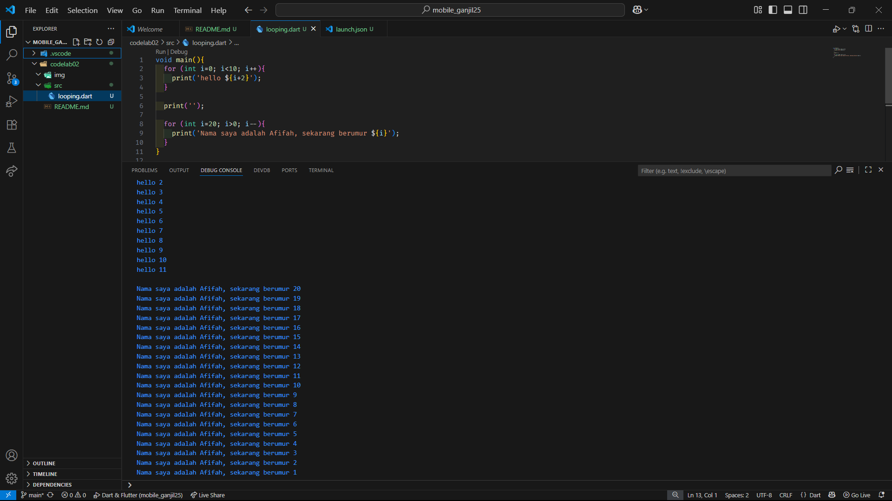

# 📘 PENGANTAR BAHASA PEMROGRAMAN DART – BAGIAN 1  

<table>
  <tr>
    <td><b>Nama</b></td>
    <td>:</td>
    <td>Afifah Khoirunnisa</td>
  </tr>
  <tr>
    <td><b>Kelas</b></td>
    <td>:</td>
    <td>TI-3G</td>
  </tr>
  <tr>
    <td><b>NIM</b></td>
    <td>:</td>
    <td>2341720250</td>
  </tr>
  <tr>
    <td><b>No. Abs</b></td>
    <td>:</td>
    <td>02</td>
  </tr>
</table>  

---

## 📝 TUGAS PRAKTIKUM  

### Soal 1  
**Modifikasilah kode pada baris 3 di VS Code atau Editor Code favorit Anda berikut ini agar mendapatkan keluaran (output) sesuai yang diminta!**  

**Jawaban:**  
  

---

### Soal 2  
**Mengapa sangat penting untuk memahami bahasa pemrograman Dart sebelum kita menggunakan framework Flutter? Jelaskan!**  

**Jawaban:**  
Memahami bahasa pemrograman Dart penting karena Flutter merupakan framework yang dibangun menggunakan Dart. Tanpa memahami Dart, kita akan kesulitan menulis kode yang efisien, membaca dokumentasi resmi Flutter, serta memanfaatkan fitur-fitur lanjutan framework dengan baik.  

---

### Soal 3  
**Rangkumlah materi dari codelab ini menjadi poin-poin penting yang dapat Anda gunakan untuk membantu proses pengembangan aplikasi mobile menggunakan framework Flutter.**  

**Jawaban:**  

- **Dart sebagai dasar Flutter** → semua kode aplikasi, plugin, dan dependensi Flutter ditulis dalam Dart.  
- **Fitur utama Dart:**  
  - Productive tooling (IDE, package manager, analyzer)  
  - Garbage collection  
  - Type annotations opsional tetapi tetap type-safe  
  - Portabilitas (kompilasi ke JavaScript, ARM, x86)  
- **Evolusi Dart** → diluncurkan 2011, stabil 2013, versi 2.0 (2018) makin matang untuk Flutter.  
- **Cara kerja Dart:**  
  - JIT (Just-In-Time) → debugging & hot reload  
  - AOT (Ahead-of-Time) → performa tinggi untuk produksi  
  - Bisa dikompilasi ke JavaScript untuk web  
- **Struktur bahasa Dart:**  
  - Object-Oriented (class, inheritance, encapsulation, polymorphism)  
  - Operator dasar mirip bahasa modern lainnya  
  - Semua tipe data adalah objek (tidak ada primitif seperti Java)  
- **Praktik pemrograman dengan Dart:**  
  - [DartPad](https://dartpad.dev) → belajar dan uji coba kode online  
  - Function `main()` → titik awal program  
  - Function vs Method → function di luar class, method terikat pada class  

---

### Soal 4  
**Buatlah penjelasan dan contoh eksekusi kode tentang perbedaan Null Safety dan Late variable!**  

**Jawaban:**  

1. **Null Safety**  
   - Fitur untuk mencegah error karena variabel bernilai `null`.  
   - Default: variabel tidak boleh `null`.  
   - Jika ingin `null`, gunakan tanda `?`.  

   **Contoh kode:**  
   ```dart
   void main() {
     String nama = "Afifah";   // tidak bisa null
     // String nama2 = null;   // ❌ error, tidak bisa null

     String? hobi;             // boleh null
     print(hobi);              // output: null

     hobi = "Membaca";
     print(hobi);              // output: Membaca
   }
2. **Late Variable**  
   - Digunakan untuk menunda inisialisasi variabel.
   - Nilainya harus diisi sebelum dipakai (misalnya lewat input atau hasil perhitungan). 

   **Contoh kode:**  
   ```dart
   void main() {
    late String namaLengkap;   // deklarasi tanpa langsung isi

    // kode lain...

    namaLengkap = "Afifah Khoirunnisa";  // baru diisi di sini
    print(namaLengkap);                  // output: Afifah Khoirunnisa
    }
    ```