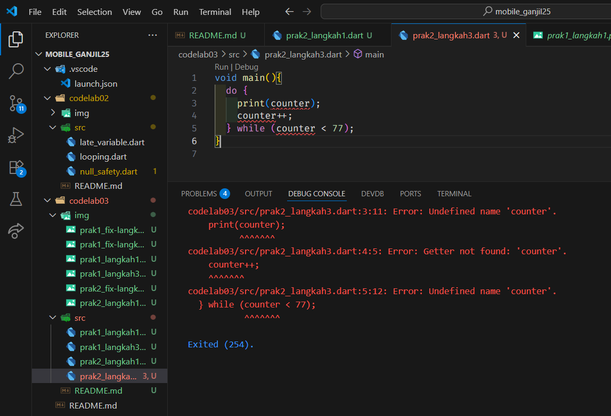

# 📘 PENGANTAR BAHASA PEMROGRAMAN DART – BAGIAN 2  

<table>
  <tr>
    <td><b>Nama</b></td>
    <td>:</td>
    <td>Afifah Khoirunnisa</td>
  </tr>
  <tr>
    <td><b>Kelas</b></td>
    <td>:</td>
    <td>TI-3G</td>
  </tr>
  <tr>
    <td><b>NIM</b></td>
    <td>:</td>
    <td>2341720250</td>
  </tr>
  <tr>
    <td><b>No. Abs</b></td>
    <td>:</td>
    <td>02</td>
  </tr>
</table>  

---

## 📝 PRAKTIKUM 1
### Langkah 1
**Ketik atau salin kode program berikut ke dalam fungsi main().**
```dart
  String test = "test2";
  if (test == "test1") {
    print("Test1");
  } else If (test == "test2") {
    print("Test2");
  } Else {
    print("Something else");
  }

  if (test == "test2") print("Test2 again");
```

### Langkah 2
**Silakan coba eksekusi (Run) kode pada langkah 1 tersebut. Apa yang terjadi? Jelaskan!**<br>
**Output Kode:**

Kode tersebut error karena harusnya menggunakan "if" bukan "If", serta harusnya menggunakan "else" bukan "Else". Hal ini menunjukkan bahwa dalam bahasa pemrograman dart, huruf kapital sangat berpengaruh.

**Perbaikan:**


### Langkah 3
**Tambahkan kode program berikut, lalu coba eksekusi (Run) kode Anda.**
```dart
  String test = "true";
  if (test) {
    print("Kebenaran");
  }
```
**Apa yang terjadi ? Jika terjadi error, silakan perbaiki namun tetap menggunakan if/else.**
**Output:**

Yang terjadi adalah error. Hal tersebut dikarenakan tidak adanya nilai dari variabel didalam "if". Jika hanya ditulis variabel saja tanpa nilai, maka kode menganggap bahwa itu adalah variabel yang bernilai boolean, bukan string.

**Perbaikan:**


## PRAKTIKUM 2
### Langkah 1
**Ketik atau salin kode program berikut ke dalam fungsi main().**
```dart
  while (counter < 33) {
    print(counter);
    counter++;
  }
```
### Langkah 2
**Silakan coba eksekusi (Run) kode pada langkah 1 tersebut. Apa yang terjadi? Jelaskan! Lalu perbaiki jika terjadi error.**

Error tersebut dikarenakan variabel counter belum dideklarasikan sebelumnya. Untuk memperbaikinya, kita bisa mendeklarasikan variabel counter sebelumnya.

**Perbaikan:**


### Langkah 3
**Tambahkan kode program berikut, lalu coba eksekusi (Run) kode Anda.**
```dart
  do {
    print(counter);
    counter++;
  } while (counter < 77);
```
**Apa yang terjadi ? Jika terjadi error, silakan perbaiki namun tetap menggunakan do-while.**
**Output:**

Error tersebut dikarenakan variabel counter belum dideklarasikan sebelumnya. Untuk memperbaikinya, kita bisa mendeklarasikan variabel counter sebelumnya.

**Perbaikan:**


## Praktikum 3
### Langkah 1
**Ketik atau salin kode program berikut ke dalam fungsi main().**
```dart
  for (Index = 10; index < 27; index) {
    print(Index);
}
```
### Langkah 2
**Silakan coba eksekusi (Run) kode pada langkah 1 tersebut. Apa yang terjadi? Jelaskan! Lalu perbaiki jika terjadi error.**
**Output:**

Kode tersebut error dikarenakan tidak ada jenis variabel "int" yang dideklarasikan sebelum nama variabel "Index". Selain itu, bear kecilnya nama variabel tidak konsisten, ada yang menggunakan "Index" dan "index". Sipaya tidak error, lebih baik disamakan besar kecilnya.

**Perbaikan:**


### Langkah 3
**Tambahkan kode program berikut di dalam for-loop, lalu coba eksekusi (Run) kode Anda.**
```dart
  If (Index == 21) break;
  Else If (index > 1 || index < 7) continue;
  print(index);
```
**Apa yang terjadi ? Jika terjadi error, silakan perbaiki namun tetap menggunakan for dan break-continue.**

**Output:**

Kode tersebut error dikarenakan variabel bernama "index belum didefinisikan. Selain itu, belum ada for loop yang saya tambahkan sehingga break dan continue tidak bisa digunakan sehingga menyebabkan error.

**Perbaikan:**


## TUGAS PRAKTIKUM
**Buatlah sebuah program yang dapat menampilkan bilangan prima dari angka 0 sampai 201 menggunakan Dart. Ketika bilangan prima ditemukan, maka tampilkan nama lengkap dan NIM Anda.**

**Output:**


### Pengecekan Bilangan Prima

Untuk setiap angka `i` (dari 0 sampai 201):

- Jika `i < 2` → **bukan prima**.
- Jika `i ≥ 2` → lakukan pengecekan pembagi dengan cara:

  Loop dari `j = 2` sampai `j = i ~/ 2`.

  - Jika ada `j` yang bisa membagi habis `i` (`i % j == 0`), maka:
    - `i` **bukan prima** → keluar dari loop.
  - Jika tidak ada `j` yang membagi habis, maka:
    - `i` **adalah prima**.

📌 Catatan:
- `~/` berarti **pembagian bulat** (floor division).
- Kenapa cukup sampai `i ~/ 2`?
  - Karena jika ada faktor dari `i`, minimal salah satunya pasti ≤ `i/2`.
  - Misalnya `6`: faktornya (2, 3). Keduanya ≤ 6/2.
  - Jadi tidak perlu cek sampai `i-1`, cukup sampai setengahnya.
