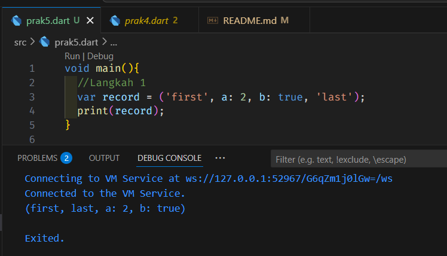
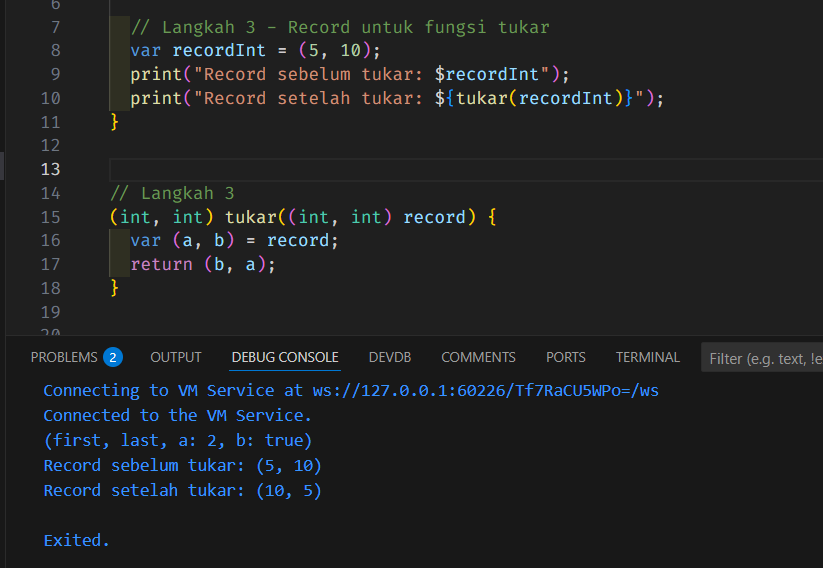
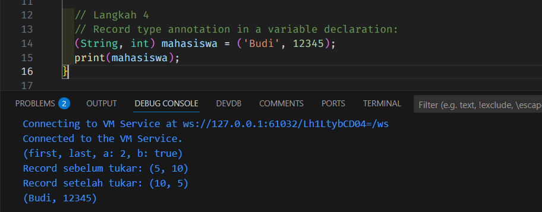
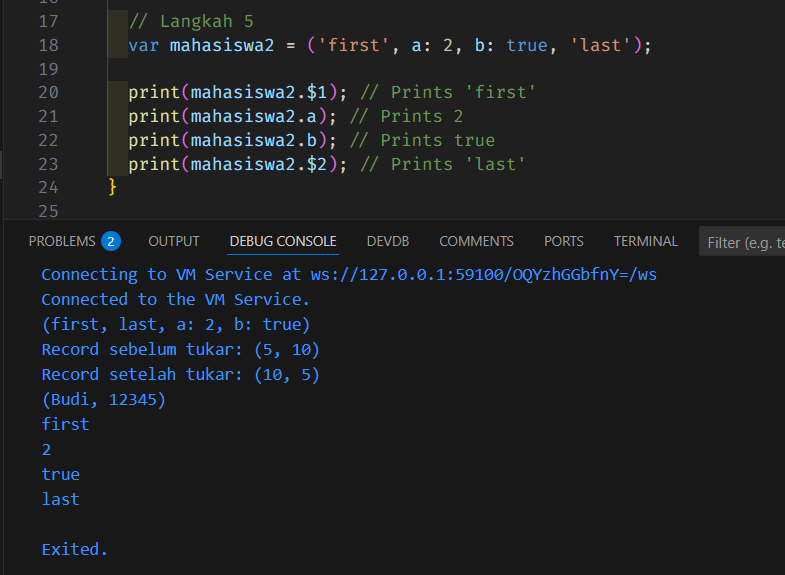
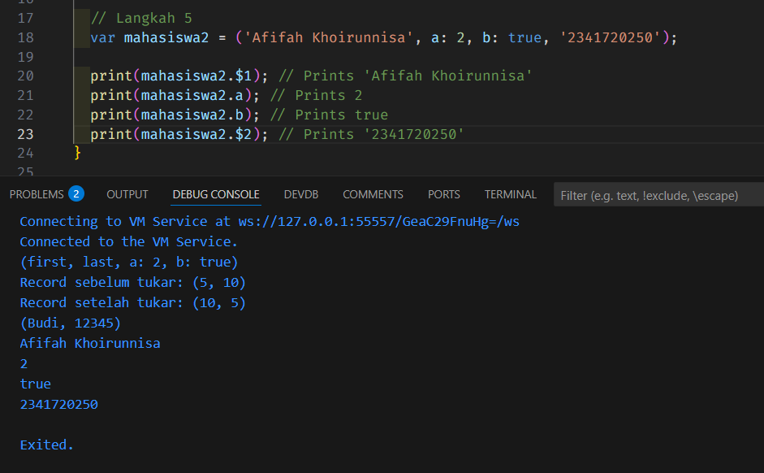

# 📘 PENGANTAR BAHASA PEMROGRAMAN DART – BAGIAN 3  

<table>
  <tr>
    <td><b>Nama</b></td>
    <td>:</td>
    <td>Afifah Khoirunnisa</td>
  </tr>
  <tr>
    <td><b>Kelas</b></td>
    <td>:</td>
    <td>TI-3G</td>
  </tr>
  <tr>
    <td><b>NIM</b></td>
    <td>:</td>
    <td>2341720250</td>
  </tr>
  <tr>
    <td><b>No. Abs</b></td>
    <td>:</td>
    <td>02</td>
  </tr>
</table>  

---
## 📝 PRAKTIKUM 1
### Langkah 1
**Ketik atau salin kode program berikut ke dalam void main().**
```dart
  var list = [1, 2, 3];
  assert(list.length == 3);
  assert(list[1] == 2);
  print(list.length);
  print(list[1]);

  list[1] = 1;
  assert(list[1] == 1);
  print(list[1]);
```
### Langkah 2
**Silakan coba eksekusi (Run) kode pada langkah 1 tersebut. Apa yang terjadi? Jelaskan!**


Pada baris pertama, output adalah 3 karena panjang list adalah 3. 

Pada baris kedua, output adalah 2 karena menampilkan list pada index 1.

Pada baris ketiga, output adalah 1 karena menampilkan list di index ke-1 diganti isinya menjadi 1

### Langkah 3
**Ubah kode pada langkah 1 menjadi variabel final yang mempunyai index = 5 dengan default value = null. Isilah nama dan NIM Anda pada elemen index ke-1 dan ke-2. Lalu print dan capture hasilnya.**

**Apa yang terjadi ? Jika terjadi error, silakan perbaiki.**


Variabel Final memiliki karakteristik yang berbeda dengan variabel var. pada kesempatan ini, saya menambahkan kode
```dart
List<String?>.filled(5, null, growable: false);
```

Jika kode itu tidak ditambahkan, maka variabel final tidak dapat dimasukkan value string jika nilai default nya adalah angka.


## PRAKTIKUM 2
### Langkah 1
**Ketik atau salin kode program berikut ke dalam fungsi main().**
```dart
var halogens = {'fluorine', 'chlorine', 'bromine', 'iodine', 'astatine'};
print(halogens);
```

### Langkah 2
**Silakan coba eksekusi (Run) kode pada langkah 1 tersebut. Apa yang terjadi? Jelaskan! Lalu perbaiki jika terjadi error.**


Kode tersebut bisa menampilkan semua isi dari variabel var termasuk isi di array-nya. 


### Langkah 3
**Tambahkan kode program berikut, lalu coba eksekusi (Run) kode Anda.**
```dart
var names1 = <String>{};
Set<String> names2 = {}; // This works, too.
var names3 = {}; // Creates a map, not a set.

print(names1);
print(names2);
print(names3);
```

**Apa yang terjadi ? Jika terjadi error, silakan perbaiki namun tetap menggunakan ketiga variabel tersebut. Tambahkan elemen nama dan NIM Anda pada kedua variabel Set tersebut dengan dua fungsi berbeda yaitu .add() dan .addAll(). Untuk variabel Map dihapus, nanti kita coba di praktikum selanjutnya.**

**Dokumentasikan code dan hasil di console, lalu buat laporannya.**


Hasil diatas tidak bisa mengeluarkan output dikarenakan masing-masing variabel tidak didefinisikan value nya.  

**Perbaikan:**


## PRAKTIKUM 3
### Langkah 1
**Ketik atau salin kode program berikut ke dalam fungsi main().**
```dart
  var gifts = {
    // Key:    Value
    'first': 'partridge',
    'second': 'turtledoves',
    'fifth': 1
  };

  var nobleGases = {
    2: 'helium',
    10: 'neon',
    18: 2,
  };

  print(gifts);
  print(nobleGases);
```

## Langkah 2
**Silakan coba eksekusi (Run) kode pada langkah 1 tersebut. Apa yang terjadi? Jelaskan! Lalu perbaiki jika terjadi error.**


Tidak terjadi error pada kode tersebut.

## Langkah 3
**Tambahkan kode program berikut, lalu coba eksekusi (Run) kode Anda.**

```dart
  var mhs1 = Map<String, String>();
  gifts['first'] = 'partridge';
  gifts['second'] = 'turtledoves';
  gifts['fifth'] = 'golden rings';

  var mhs2 = Map<int, String>();
  nobleGases[2] = 'helium';
  nobleGases[10] = 'neon';
  nobleGases[18] = 'argon';
```

**Apa yang terjadi ? Jika terjadi error, silakan perbaiki.**

Error itu muncul karena di map awal campur-campur isiannya, ada yang berupa teks (**String**) dan ada yang berupa angka (**int**). Akibatnya, Dart bingung harus menganggap tipe datanya apa. Waktu coba ganti isi yang tadinya angka jadi teks, Dart anggap itu tidak cocok dengan tipe awal sehingga muncul error. Supaya aman, dari awal langsung tentukan tipe map-nya, misalnya semua isi harus String (`<String, String>`) atau sesuai kebutuhan, biar konsisten dan tidak bikin error.

**Perbaikan:**
```dart
  void main() {
    // Map dengan key bertipe String dan value String
    var gifts = <String, String>{
      'first': 'partridge',
      'second': 'turtledoves',
      'fifth': 'golden rings',
      'name': 'Afifah Khoirunnisa',
      'nim': '2241720010',
    };

    // Map dengan key bertipe int dan value String
    var nobleGases = <int, String>{
      2: 'helium',
      10: 'neon',
      18: 'argon',
      99: 'Afifah Khoirunnisa',
      100: '2241720010',
    };

    print("Isi gifts: $gifts");
    print("Isi nobleGases: $nobleGases");

    // Map kosong yang diisi manual
    var mhs1 = Map<String, String>();
    mhs1['first'] = 'partridge';
    mhs1['second'] = 'turtledoves';
    mhs1['fifth'] = 'golden rings';
    mhs1['name'] = 'Afifah Khoirunnisa';
    mhs1['nim'] = '2241720010';

    var mhs2 = Map<int, String>();
    mhs2[2] = 'helium';
    mhs2[10] = 'neon';
    mhs2[18] = 'argon';
    mhs2[99] = 'Afifah Khoirunnisa';
    mhs2[100] = '2241720010';

    print("Isi mhs1: $mhs1");
    print("Isi mhs2: $mhs2");
  }
```


## PRAKTIKUM 4
### Langkah 1
**Ketik atau salin kode program berikut ke dalam fungsi main().**

```dart
  var list = [1, 2, 3];
  var list2 = [0, ...list];
  print(list1);
  print(list2);
  print(list2.length);
```

### Langkah 2
**Silakan coba eksekusi (Run) kode pada langkah 1 tersebut. Apa yang terjadi? Jelaskan! Lalu perbaiki jika terjadi error.**


Error tersebut dikarenakan variabel list1 belum didefinisikan.


### Langkah 3
**Tambahkan kode program berikut, lalu coba eksekusi (Run) kode Anda.**
```dart
  list1 = [1, 2, null];
  print(list1);
  var list3 = [0, ...?list1];
  print(list3.length)
```

**Apa yang terjadi ? Jika terjadi error, silakan perbaiki.**


**Tambahkan variabel list berisi NIM Anda menggunakan Spread Operators.**


### Langkah 4:
**Tambahkan kode program berikut, lalu coba eksekusi (Run) kode Anda.**

```dart
var nav = ['Home', 'Furniture', 'Plants', if (promoActive) 'Outlet'];
print(nav);
```
**Apa yang terjadi ? Jika terjadi error, silakan perbaiki. Tunjukkan hasilnya jika variabel promoActive ketika true dan false.**

Kode diatas error karena memang boolean promoActive belum tertulis booleannya bernilai true atau false.

**Perbaikan:**


### Langkah 5
**Tambahkan kode program berikut, lalu coba eksekusi (Run) kode Anda.**
```dart
var nav2 = ['Home', 'Furniture', 'Plants', if (login case 'Manager') 'Inventory'];
print(nav2);
```
**Apa yang terjadi ? Jika terjadi error, silakan perbaiki. Tunjukkan hasilnya jika variabel login mempunyai kondisi lain.**

Kode tersebut error, dikarenakan value dari login belum didefinisikan.
**Perbaikan:**


### Langkah 6
**Tambahkan kode program berikut, lalu coba eksekusi (Run) kode Anda.**
```dart
var listOfInts = [1, 2, 3];
var listOfStrings = ['#0', for (var i in listOfInts) '#$i'];
assert(listOfStrings[1] == '#1');
print(listOfStrings);
```
**Apa yang terjadi ? Jika terjadi error, silakan perbaiki. Jelaskan manfaat Collection For dan dokumentasikan hasilnya.**

Kode tersebut berfungsi untuk membuat perulangan angka, walaupun didepannya ada simbol "#", tapi perulangan for tetap dapat berjalan.


Manfaat dari kode collection for adalah membuat kode menjadi lebih ringkas. Jadi, kita tidak perlu untuk membuat kode berulang-ulang.

## PRAKTIKUM 5
### Langkah 1
**Ketik atau salin kode program berikut ke dalam fungsi main().**

```dart
var record = ('first', a: 2, b: true, 'last');
print(record)
```

### Langkah 2
**Silakan coba eksekusi (Run) kode pada langkah 1 tersebut. Apa yang terjadi? Jelaskan! Lalu perbaiki jika terjadi error.**


Kode diatas menggunakan record, fitur baru di dart versi 3.0 yang memungkinkan kita menyimpan beberapa nilai dengan tipe data yang berbeda dalam satu struktur dara, mirip seperti tuple.


### Langkah 3
**Tambahkan kode program berikut di luar scope void main(), lalu coba eksekusi (Run) kode Anda.**
```dart
(int, int) tukar((int, int) record) {
  var (a, b) = record;
  return (b, a);
}
```
Jika menggunakan kode diatas saja, maka akan error karena tidak di panggil dalam fungsi main, berikut adalah kode perbaikannya:



### Langkah 4
**Tambahkan kode program berikut di dalam scope void main(), lalu coba eksekusi (Run) kode Anda.**
```dart
// Record type annotation in a variable declaration:
(String, int) mahasiswa;
print(mahasiswa);
```
**Apa yang terjadi ? Jika terjadi error, silakan perbaiki. Inisialisasi field nama dan NIM Anda pada variabel record mahasiswa di atas. Dokumentasikan hasilnya dan buat laporannya!**

Kode diatas error dikarenakan value dari mahasiswa belum dimasukkan. Berikut adalah perbaikannya


### Langkah 5
**Tambahkan kode program berikut di dalam scope void main(), lalu coba eksekusi (Run) kode Anda.**

```dart
var mahasiswa2 = ('first', a: 2, b: true, 'last');

print(mahasiswa2.$1); // Prints 'first'
print(mahasiswa2.a); // Prints 2
print(mahasiswa2.b); // Prints true
print(mahasiswa2.$2); // Prints 'last'
```

**Apa yang terjadi ? Jika terjadi error, silakan perbaiki. Gantilah salah satu isi record dengan nama dan NIM Anda, lalu dokumentasikan hasilnya dan buat laporannya!**



Tidak ada error yang terjadi.
Berikut adalah kode yang sudah dimodifikasi nim dan nama.


## TUGAS PRAKTIKUM

**1. Jelaskan yang dimaksud Functions dalam bahasa Dart!**

Fungsi adalah blok kode yang dirancang untuk menjalankan tugas tertentu. Fungsi membantu mengorganisasi kode, membuatnya lebih mudah dibaca, dikelola, dan menghindari penulisan kode yang berulang. Setiap fungsi memiliki nama, dapat menerima input (disebut parameter), dan dapat menghasilkan output (disebut nilai kembalian atau return value).

**2. Jelaskan jenis-jenis parameter di Functions beserta contoh sintaksnya!**

- Parameter Wajib (Required Positional Parameters)
Parameter ini harus selalu diberikan saat memanggil fungsi, dan urutannya harus sesuai dengan urutan saat dideklarasikan.

```dart
void tampilkanData(String nama, int umur) {
  print('Nama: $nama, Umur: $umur');
}

tampilkanData('Budi', 25);
```

- Parameter Bernama (Named Parameters)
Parameter ini dikelilingi kurung kurawal {}. Kamu bisa memberikannya dalam urutan apa pun saat memanggil fungsi, asalkan menyebutkan namanya. Untuk membuatnya wajib, tambahkan required.
```dart
void cetakInfo({required String nama, int? umur}) {
  print('Nama: $nama');
  if (umur != null) {
    print('Umur: $umur');
  }
}

cetakInfo(umur: 30, nama: 'Andi');
```

- Parameter Opsional (Optional Positional Parameters)
Parameter ini dikelilingi kurung siku [] dan bersifat opsional. Jika tidak diberikan, nilainya akan null atau nilai default yang sudah kamu tentukan.
```dart
void sapa(String nama, [String? sapaan]) {
  var pesan = sapaan ?? 'Halo';
  print('$pesan, $nama!');
}

sapa('Ani');
sapa('Fajar', 'Selamat pagi');
```

**3. Jelaskan maksud Functions sebagai first-class objects beserta contoh sintaknya!**

Di Dart, fungsi bisa diperlakukan seperti variabel. Kegunaannya yaitu:

- Menyimpan fungsi dalam sebuah variabel:
```dart
int Function(int, int) tambah = (a, b) => a + b;
var hasil = tambah(5, 3);
print(hasil);
```

- Meneruskan fungsi sebagai argumen ke fungsi lain:
```dart
void jalankanOperasi(int a, int b, int Function(int, int) operasi) {
  print(operasi(a, b));
}

jalankanOperasi(10, 5, (a, b) => a - b);
```

**4. Apa itu Anonymous Functions? Jelaskan dan berikan contohnya!**
Anonymous functions adalah fungsi yang tidak memiliki nama. Fungsi ini biasanya digunakan untuk tugas yang singkat dan spesifik, misalnya saat iterasi di sebuah list atau saat mendefinisikan callback.

```dart
var angka = [1, 2, 3];

// Anonymous function di dalam forEach
angka.forEach((e) {
  print('Angka: $e');
});

// Versi lebih ringkas (arrow function)
angka.forEach((e) => print('Angka: $e'));
```

**5. Jelaskan perbedaan Lexical scope dan Lexical closures! Berikan contohnya!**

- Lexical Scope: Ini adalah aturan di mana sebuah variabel bisa diakses, yang ditentukan oleh posisi penulisannya di kode. Variabel yang dideklarasikan di luar sebuah fungsi bisa diakses dari dalam fungsi tersebut, tapi variabel di dalam fungsi tidak bisa diakses dari luar.
```dart
var variabelLuar = 'Halo';

void fungsiDalam() {
  var variabelDalam = 'Dunia';
  print('$variabelLuar $variabelDalam'); // Bisa mengakses variabelLuar
}
// print(variabelDalam); // Error: variabelDalam tidak terdefinisi di sini
```

- Lexical Closures: Closure adalah sebuah fungsi yang bisa mengakses variabel dari lingkup (scope) tempat ia dibuat, bahkan setelah lingkup tersebut sudah selesai dieksekusi. Closure ini "mengunci" akses ke variabel-variabel dari lingkup induknya.
```dart
Function buatPenghitung() {
  int hitungan = 0;
  return () {
    hitungan++;
    print(hitungan);
  };
}

var hitung = buatPenghitung();
hitung(); // Output: 1
hitung(); // Output: 2
// Variabel `hitungan` tetap ada dan nilainya berubah setiap kali fungsi `hitung()` dipanggil.
```

**6. Jelaskan dengan contoh cara membuat return multiple value di Functions!**
Secara standar, fungsi hanya bisa mengembalikan satu nilai. Namun, kamu bisa mengembalikan beberapa nilai dengan:

- Menggunakan Record: Fitur ini (sejak Dart 3.0) memungkinkan kamu mengembalikan beberapa nilai dengan tipe data yang sudah ditentukan.
```dart
(String, int) ambilDataUser() {
  return ('Rina', 24);
}

var (nama, umur) = ambilDataUser(); // Langsung dipecah ke variabel
print('Nama: $nama, Umur: $umur');
```

- Menggunakan List atau Map: Cara ini bisa kamu gunakan untuk mengemas nilai-nilai ke dalam satu objek.
```dart
List<dynamic> ambilData() {
  return ['Siti', 28, true];
}

var data = ambilData();
print('Nama: ${data[0]}, Umur: ${data[1]}');
```