# 📘 PENGANTAR BAHASA PEMROGRAMAN DART – BAGIAN 3  

<table>
  <tr>
    <td><b>Nama</b></td>
    <td>:</td>
    <td>Afifah Khoirunnisa</td>
  </tr>
  <tr>
    <td><b>Kelas</b></td>
    <td>:</td>
    <td>TI-3G</td>
  </tr>
  <tr>
    <td><b>NIM</b></td>
    <td>:</td>
    <td>2341720250</td>
  </tr>
  <tr>
    <td><b>No. Abs</b></td>
    <td>:</td>
    <td>02</td>
  </tr>
</table>  

---
## 📝 PRAKTIKUM 1
### Langkah 1
**Ketik atau salin kode program berikut ke dalam void main().**
```dart
  var list = [1, 2, 3];
  assert(list.length == 3);
  assert(list[1] == 2);
  print(list.length);
  print(list[1]);

  list[1] = 1;
  assert(list[1] == 1);
  print(list[1]);
```
### Langkah 2
**Silakan coba eksekusi (Run) kode pada langkah 1 tersebut. Apa yang terjadi? Jelaskan!**
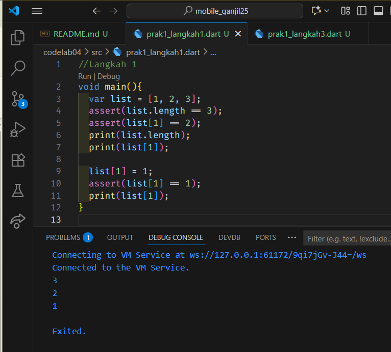

Pada baris pertama, output adalah 3 karena panjang list adalah 3. 

Pada baris kedua, output adalah 2 karena menampilkan list pada index 1.

Pada baris ketiga, output adalah 1 karena menampilkan list di index ke-1 diganti isinya menjadi 1

### Langkah 3
**Ubah kode pada langkah 1 menjadi variabel final yang mempunyai index = 5 dengan default value = null. Isilah nama dan NIM Anda pada elemen index ke-1 dan ke-2. Lalu print dan capture hasilnya.**

**Apa yang terjadi ? Jika terjadi error, silakan perbaiki.**
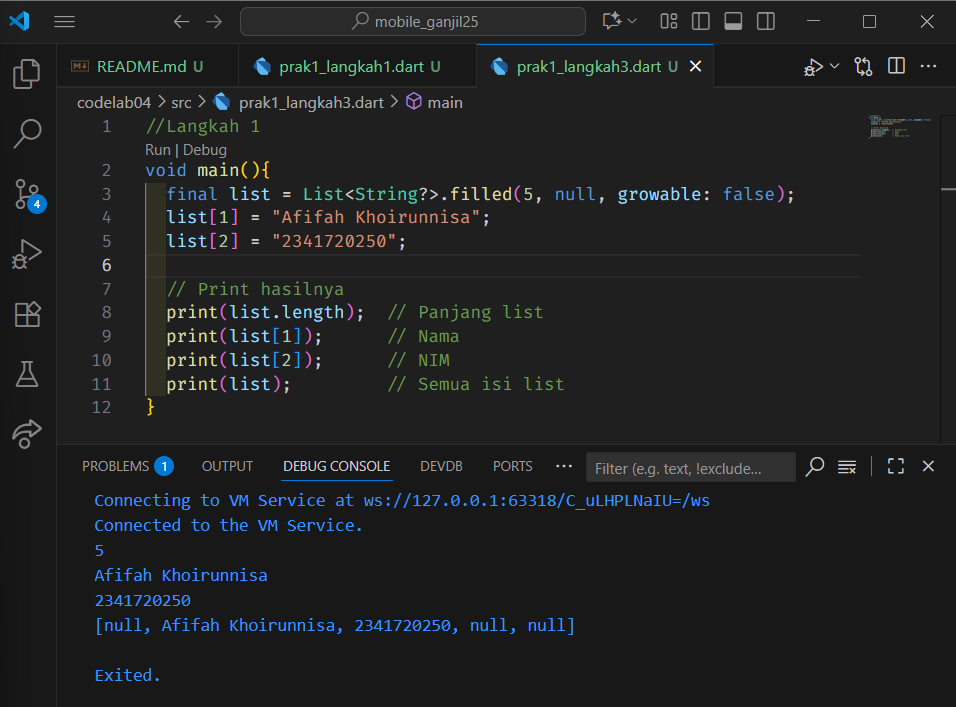

Variabel Final memiliki karakteristik yang berbeda dengan variabel var. pada kesempatan ini, saya menambahkan kode
```dart
List<String?>.filled(5, null, growable: false);
```

Jika kode itu tidak ditambahkan, maka variabel final tidak dapat dimasukkan value string jika nilai default nya adalah angka.


## PRAKTIKUM 2
### Langkah 1
**Ketik atau salin kode program berikut ke dalam fungsi main().**
```dart
var halogens = {'fluorine', 'chlorine', 'bromine', 'iodine', 'astatine'};
print(halogens);
```

### Langkah 2
**Silakan coba eksekusi (Run) kode pada langkah 1 tersebut. Apa yang terjadi? Jelaskan! Lalu perbaiki jika terjadi error.**
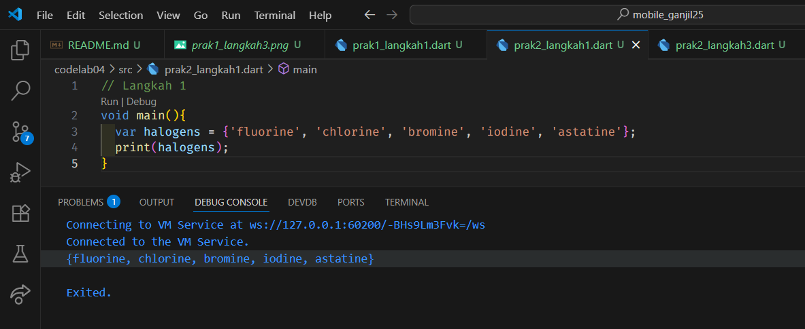

Kode tersebut bisa menampilkan semua isi dari variabel var termasuk isi di array-nya. 


### Langkah 3
**Tambahkan kode program berikut, lalu coba eksekusi (Run) kode Anda.**
```dart
var names1 = <String>{};
Set<String> names2 = {}; // This works, too.
var names3 = {}; // Creates a map, not a set.

print(names1);
print(names2);
print(names3);
```

**Apa yang terjadi ? Jika terjadi error, silakan perbaiki namun tetap menggunakan ketiga variabel tersebut. Tambahkan elemen nama dan NIM Anda pada kedua variabel Set tersebut dengan dua fungsi berbeda yaitu .add() dan .addAll(). Untuk variabel Map dihapus, nanti kita coba di praktikum selanjutnya.**

**Dokumentasikan code dan hasil di console, lalu buat laporannya.**

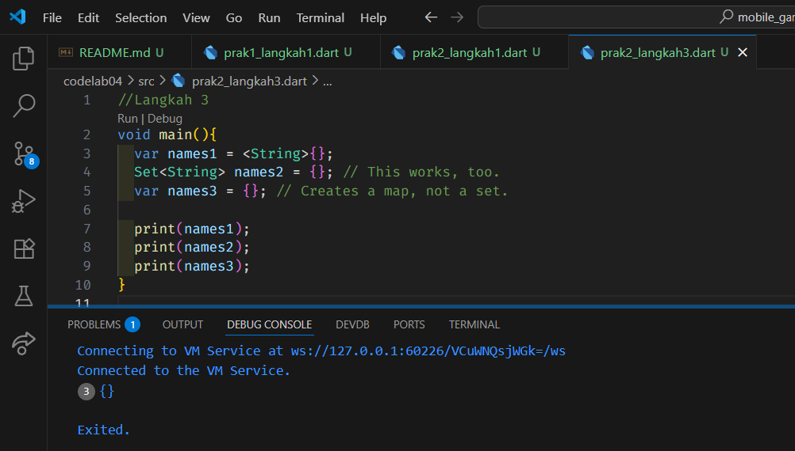

Hasil diatas tidak bisa mengeluarkan output dikarenakan masing-masing variabel tidak didefinisikan value nya.  

**Perbaikan:**
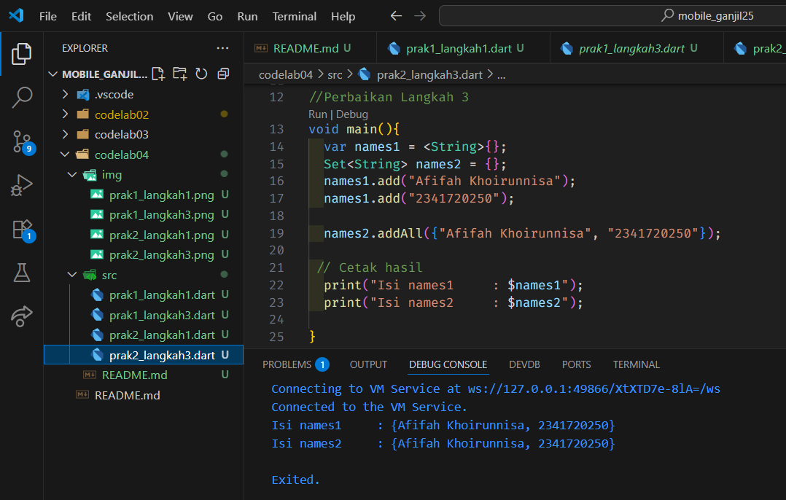

## PRAKTIKUM 3
### Langkah 1
**Ketik atau salin kode program berikut ke dalam fungsi main().**
```dart
  var gifts = {
    // Key:    Value
    'first': 'partridge',
    'second': 'turtledoves',
    'fifth': 1
  };

  var nobleGases = {
    2: 'helium',
    10: 'neon',
    18: 2,
  };

  print(gifts);
  print(nobleGases);
```

## Langkah 2
**Silakan coba eksekusi (Run) kode pada langkah 1 tersebut. Apa yang terjadi? Jelaskan! Lalu perbaiki jika terjadi error.**

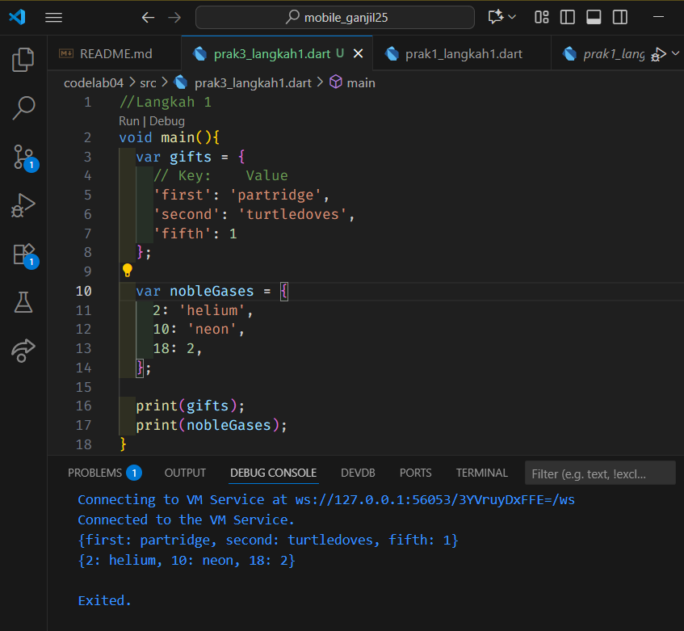

Tidak terjadi error pada kode tersebut.

## Langkah 3
**Tambahkan kode program berikut, lalu coba eksekusi (Run) kode Anda.**

```dart
  var mhs1 = Map<String, String>();
  gifts['first'] = 'partridge';
  gifts['second'] = 'turtledoves';
  gifts['fifth'] = 'golden rings';

  var mhs2 = Map<int, String>();
  nobleGases[2] = 'helium';
  nobleGases[10] = 'neon';
  nobleGases[18] = 'argon';
```

**Apa yang terjadi ? Jika terjadi error, silakan perbaiki.**

Error itu muncul karena di map awal campur-campur isiannya, ada yang berupa teks (**String**) dan ada yang berupa angka (**int**). Akibatnya, Dart bingung harus menganggap tipe datanya apa. Waktu coba ganti isi yang tadinya angka jadi teks, Dart anggap itu tidak cocok dengan tipe awal sehingga muncul error. Supaya aman, dari awal langsung tentukan tipe map-nya, misalnya semua isi harus String (`<String, String>`) atau sesuai kebutuhan, biar konsisten dan tidak bikin error.

**Perbaikan:**
```dart
  void main() {
    // Map dengan key bertipe String dan value String
    var gifts = <String, String>{
      'first': 'partridge',
      'second': 'turtledoves',
      'fifth': 'golden rings',
      'name': 'Afifah Khoirunnisa',
      'nim': '2241720010',
    };

    // Map dengan key bertipe int dan value String
    var nobleGases = <int, String>{
      2: 'helium',
      10: 'neon',
      18: 'argon',
      99: 'Afifah Khoirunnisa',
      100: '2241720010',
    };

    print("Isi gifts: $gifts");
    print("Isi nobleGases: $nobleGases");

    // Map kosong yang diisi manual
    var mhs1 = Map<String, String>();
    mhs1['first'] = 'partridge';
    mhs1['second'] = 'turtledoves';
    mhs1['fifth'] = 'golden rings';
    mhs1['name'] = 'Afifah Khoirunnisa';
    mhs1['nim'] = '2241720010';

    var mhs2 = Map<int, String>();
    mhs2[2] = 'helium';
    mhs2[10] = 'neon';
    mhs2[18] = 'argon';
    mhs2[99] = 'Afifah Khoirunnisa';
    mhs2[100] = '2241720010';

    print("Isi mhs1: $mhs1");
    print("Isi mhs2: $mhs2");
  }
```

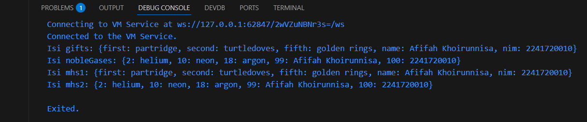

## PRAKTIKUM 4
### Langkah 1
**Ketik atau salin kode program berikut ke dalam fungsi main().**

```dart
  var list = [1, 2, 3];
  var list2 = [0, ...list];
  print(list1);
  print(list2);
  print(list2.length);
```

### Langkah 2
**Silakan coba eksekusi (Run) kode pada langkah 1 tersebut. Apa yang terjadi? Jelaskan! Lalu perbaiki jika terjadi error.**

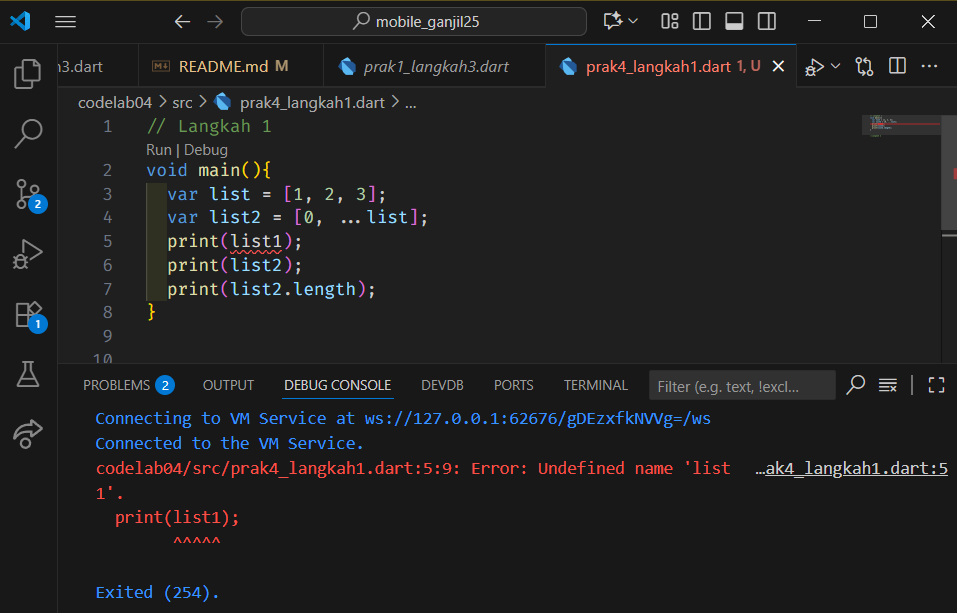
Error tersebut dikarenakan variabel list1 belum didefinisikan.

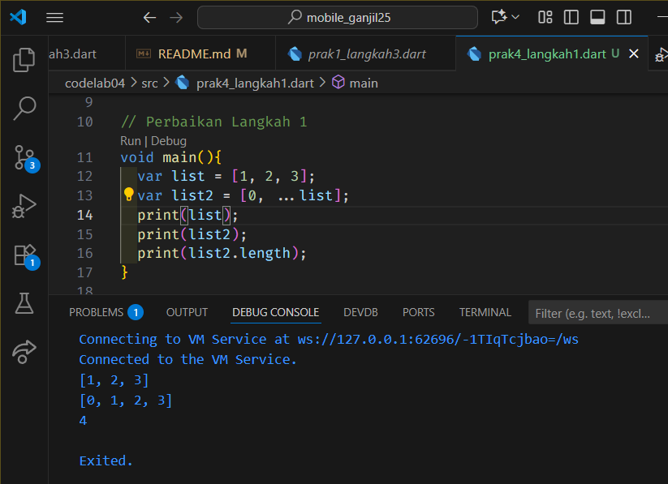

### Langkah 3
**Tambahkan kode program berikut, lalu coba eksekusi (Run) kode Anda.**
```dart
  list1 = [1, 2, null];
  print(list1);
  var list3 = [0, ...?list1];
  print(list3.length)
```

**Apa yang terjadi ? Jika terjadi error, silakan perbaiki.**
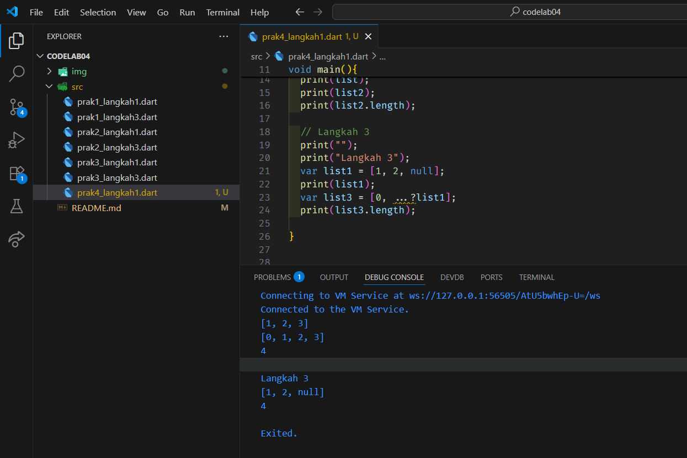

**Tambahkan variabel list berisi NIM Anda menggunakan Spread Operators.**
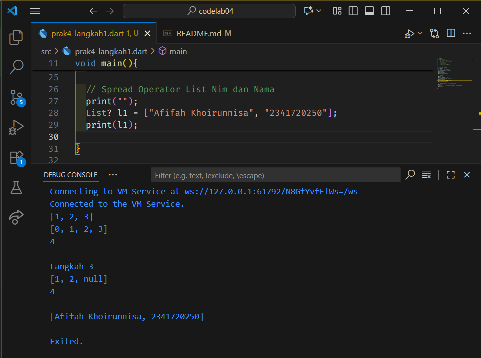

## Langkah 4:
**Tambahkan kode program berikut, lalu coba eksekusi (Run) kode Anda.**

```dart
var nav = ['Home', 'Furniture', 'Plants', if (promoActive) 'Outlet'];
print(nav);
```
**Apa yang terjadi ? Jika terjadi error, silakan perbaiki. Tunjukkan hasilnya jika variabel promoActive ketika true dan false.**

Kode diatas error karena memang boolean promoActive belum tertulis booleannya bernilai true atau false.

**Perbaikan:**
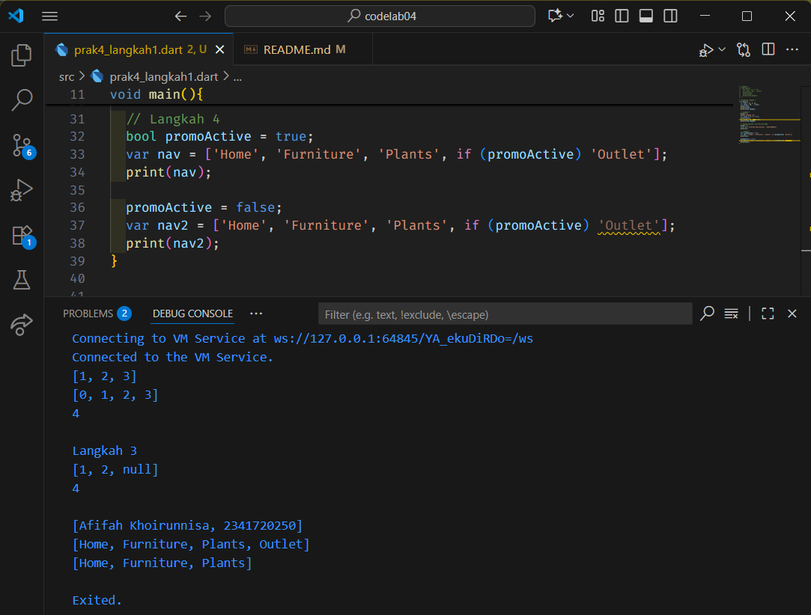

## Langkah 5
**Tambahkan kode program berikut, lalu coba eksekusi (Run) kode Anda.**
```dart
var nav2 = ['Home', 'Furniture', 'Plants', if (login case 'Manager') 'Inventory'];
print(nav2);
```
**Apa yang terjadi ? Jika terjadi error, silakan perbaiki. Tunjukkan hasilnya jika variabel login mempunyai kondisi lain.**

Kode tersebut error, dikarenakan value dari login belum didefinisikan.
**Perbaikan:**
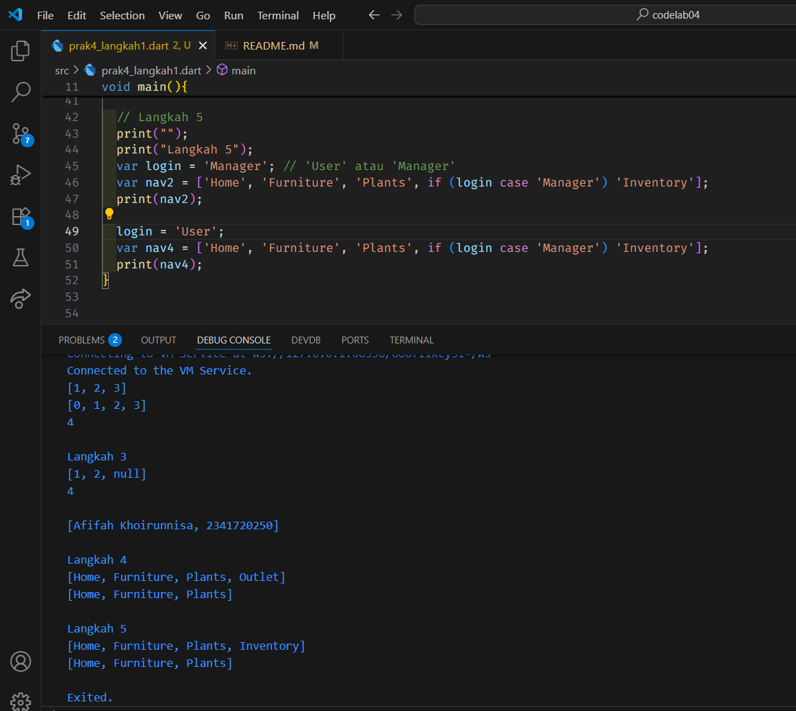

## Langkah 6
**Tambahkan kode program berikut, lalu coba eksekusi (Run) kode Anda.**
```dart
var listOfInts = [1, 2, 3];
var listOfStrings = ['#0', for (var i in listOfInts) '#$i'];
assert(listOfStrings[1] == '#1');
print(listOfStrings);
```
**Apa yang terjadi ? Jika terjadi error, silakan perbaiki. Jelaskan manfaat Collection For dan dokumentasikan hasilnya.**

Kode tersebut berfungsi untuk membuat perulangan angka, walaupun didepannya ada simbol "#", tapi perulangan for tetap dapat berjalan.

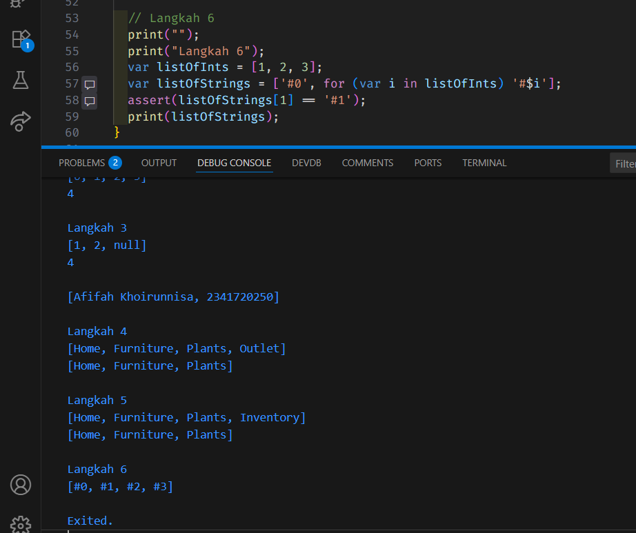

Manfaat dari kode collection for adalah membuat kode menjadi lebih ringkas. Jadi, kita tidak perlu untuk membuat kode berulang-ulang.