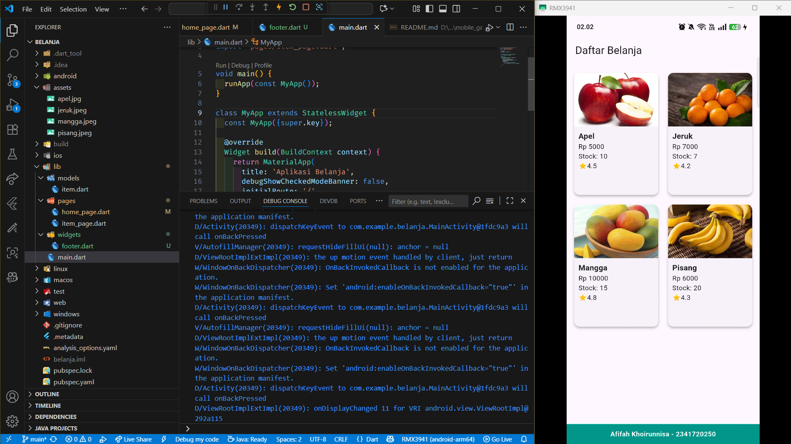

# LAYOUT DAN NAVIGASI 🎯

<table>
  <tr>
    <td><b>Nama</b></td>
    <td>:</td>
    <td>Afifah Khoirunnisa</td>
  </tr>
  <tr>
    <td><b>Kelas</b></td>
    <td>:</td>
    <td>TI-3G</td>
  </tr>
  <tr>
    <td><b>NIM</b></td>
    <td>:</td>
    <td>2341720250</td>
  </tr>
  <tr>
    <td><b>No. Abs</b></td>
    <td>:</td>
    <td>02</td>
  </tr>
</table>  

---
## Praktikum 1: Membangun Layout di Flutter
**Berikut adalah implementasi title row dalam flutter**

## PRAKTIKUM 2

## PRAKTIKUM 3

## PRAKTIKUM 4

## TUGAS PRAKTIKUM 1

## PRAKTIKUM 5

## TUGAS PRAKTIKUM 2

