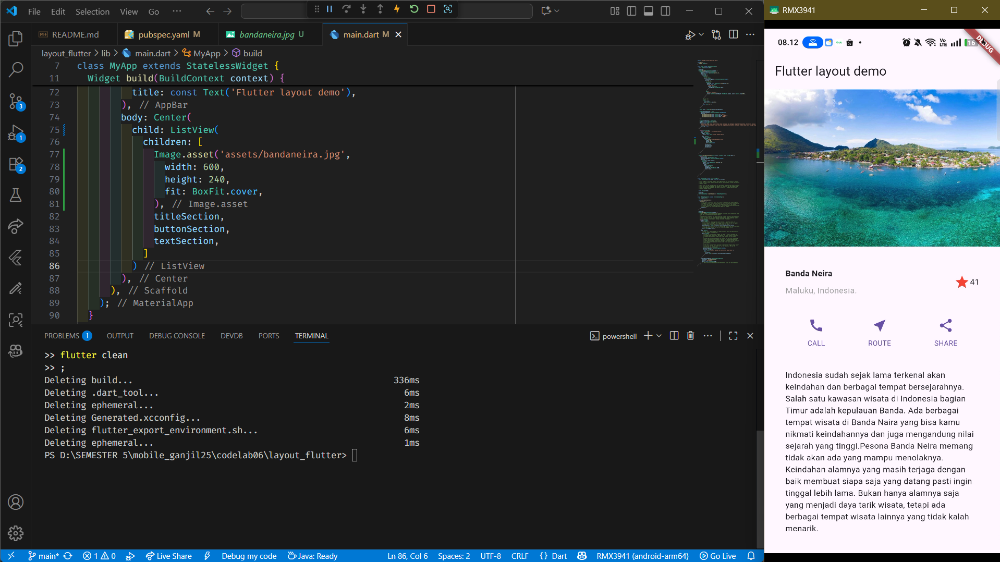

# LAYOUT DAN NAVIGASI 🎯

<table>
  <tr>
    <td><b>Nama</b></td>
    <td>:</td>
    <td>Afifah Khoirunnisa</td>
  </tr>
  <tr>
    <td><b>Kelas</b></td>
    <td>:</td>
    <td>TI-3G</td>
  </tr>
  <tr>
    <td><b>NIM</b></td>
    <td>:</td>
    <td>2341720250</td>
  </tr>
  <tr>
    <td><b>No. Abs</b></td>
    <td>:</td>
    <td>02</td>
  </tr>
</table>  

---
## Praktikum 1: Membangun Layout di Flutter
**Berikut adalah implementasi title row dalam flutter**

Pada kesempatan ini, saya membuat adanya title row yang didalamnya terdapat 2 baris dan 2 kolom
- Baris pertama → Nama tempat di kiri, ikon bintang + angka di kanan
- Baris kedua → Lokasi

## Praktikum 2: Implementasi button row
**Berikut adalah implementasi button row dalam flutter**


## Praktikum 3: Implementasi text section
**Berikut adalah implementasi text section dalam flutter**


## Praktikum 4: Implementasi image section
**Berikut adalah implementasi image section dalam flutter**


## Tugas Praktikum 1
Pada tugas praktikum 1 kali ini, saya membuat layout mengenai makanan beserta rating dan penjelasannya.


## Praktikum 5: Membangun Navigasi di Flutter
Output dari praktikum ini adalah membangun aplikasi multi halaman menggunakan list view.


## TUGAS PRAKTIKUM 2
1. **Untuk melakukan pengiriman data ke halaman berikutnya, cukup menambahkan informasi arguments pada penggunaan Navigator. Perbarui kode pada bagian Navigator menjadi seperti berikut.**

```dart
Navigator.pushNamed(context, '/item', arguments: item);
```

Jadi fungsinya berfungsi untuk membuka halaman /item sambil membawa data item.

2. **Pembacaan nilai yang dikirimkan pada halaman sebelumnya dapat dilakukan menggunakan ModalRoute. Tambahkan kode berikut pada blok fungsi build dalam halaman ItemPage. Setelah nilai didapatkan, anda dapat menggunakannya seperti penggunaan variabel pada umumnya. (https://docs.flutter.dev/cookbook/navigation/navigate-with-arguments)**

```dart
final itemArgs = ModalRoute.of(context)!.settings.arguments as Item;
```

Baris ini dipakai untuk mengambil data (arguments) yang dikirim lewat Navigator.pushNamed.

3. **Menggunakan grid view**
4. **Mengimplementasikan hero widget**
 5. **Sesuaikan dan modifikasi tampilan sehingga menjadi aplikasi yang menarik. Selain itu, pecah widget menjadi kode yang lebih kecil. Tambahkan Nama dan NIM di footer aplikasi belanja Anda.**
 
**Berikut output akhirnya:**


