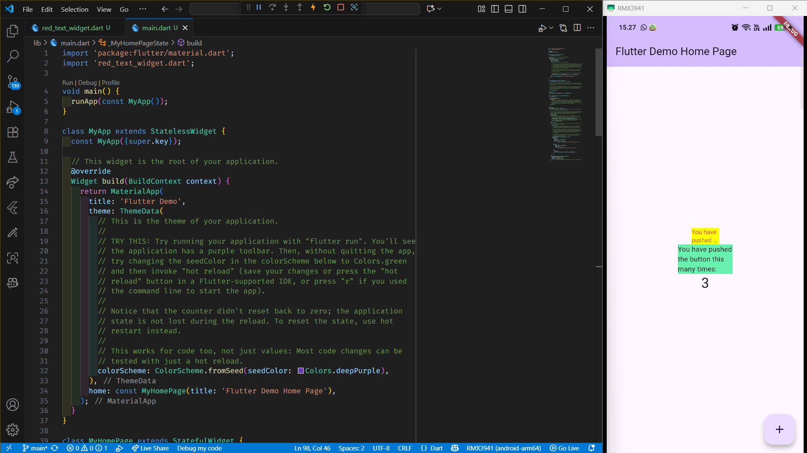

# MANAGEMENT PLUGIN 🤗

<table>
  <tr>
    <td><b>Nama</b></td>
    <td>:</td>
    <td>Afifah Khoirunnisa</td>
  </tr>
  <tr>
    <td><b>Kelas</b></td>
    <td>:</td>
    <td>TI-3G</td>
  </tr>
  <tr>
    <td><b>NIM</b></td>
    <td>:</td>
    <td>2341720250</td>
  </tr>
  <tr>
    <td><b>No. Abs</b></td>
    <td>:</td>
    <td>02</td>
  </tr>
</table>  

---

# PRAKTIKUM 1


# TUGAS PRAKTIKUM 
1. **Jelaskan maksud dari langkah 2 pada praktikum tersebut!**

    Langkah flutter pub add auto_size_text pada praktikum Flutter berarti menambahkan dependensi (package) bernama auto_size_text ke dalam proyek Flutter secara otomatis.

    Perintah:

    ```flutter pub add auto_size_text```

    berfungsi untuk menginstal library eksternal dari pub.dev (repositori resmi paket Flutter dan Dart).

    Dalam hal ini, paket yang ditambahkan adalah auto_size_text, yaitu package yang digunakan agar teks dalam widget otomatis menyesuaikan ukuran font-nya supaya tetap muat di dalam batas lebar/tinggi tertentu.

2. **Jelaskan maksud dari langkah 5 pada praktikum tersebut!**

    Langkah ini bertujuan untuk membuat konstruktor widget kustom (RedTextWidget) yang menerima teks sebagai input, agar saat widget digunakan, kita bisa menentukan sendiri teks apa yang akan ditampilkan.

3. **Pada langkah 6 terdapat dua widget yang ditambahkan, jelaskan fungsi dan perbedaannya!**

    Langkah 6 bertujuan untuk membandingkan perbedaan perilaku antara widget kustom (RedTextWidget yang menggunakan AutoSizeText) dan widget Text biasa, terutama saat keduanya ditempatkan dalam container dengan lebar terbatas.

    Hasilnya: RedTextWidget mampu menyesuaikan ukuran teks agar tetap terbaca, sedangkan Text biasa tidak.

4. **Jelaskan maksud dari tiap parameter yang ada di dalam plugin auto_size_text berdasarkan tautan pada dokumentasi ini !**

    Plugin **`auto_size_text`** digunakan untuk membuat teks secara otomatis menyesuaikan ukuran hurufnya agar **muat di dalam container** tanpa terpotong.  
    Berikut penjelasan setiap parameter yang umum digunakan dalam plugin ini:

| Parameter | Arti Sederhana | Contoh / Penjelasan Tambahan |
|------------|----------------|-------------------------------|
| `text` | Isi teks yang akan ditampilkan. | Misalnya: `"Halo, Afifah!"`. |
| `style` | Gaya tulisan. | Bisa mengatur warna, jenis huruf, atau ukuran awal teks. Contoh: `style: TextStyle(color: Colors.red, fontSize: 20)`. |
| `minFontSize` | Ukuran huruf **terkecil** yang boleh digunakan saat teks dikecilkan. | Contoh: `minFontSize: 10` → teks tidak akan lebih kecil dari ukuran 10. |
| `maxFontSize` | Ukuran huruf **terbesar** yang boleh digunakan. | Mencegah teks terlalu besar. |
| `stepGranularity` | Langkah pengecilan huruf tiap percobaan agar muat. | Contoh: `stepGranularity: 1` → ukuran huruf dicoba dikurangi 1 demi 1. |
| `presetFontSizes` | Daftar ukuran huruf yang boleh dipakai. | Contoh: `[40, 30, 20, 10]`. Jika ini diisi, `minFontSize` dan `maxFontSize` diabaikan. |
| `group` | Menyamakan ukuran teks di beberapa `AutoSizeText`. | Semua teks dalam satu grup akan menyesuaikan ukuran font yang sama. |
| `textAlign` | Menentukan posisi teks. | Contoh: `TextAlign.center` untuk rata tengah. |
| `textDirection` | Arah tulisan. | Misalnya dari kiri ke kanan (`TextDirection.ltr`) atau kanan ke kiri. |
| `locale` | Bahasa atau wilayah teks. | Digunakan untuk pemilihan font yang sesuai bahasa. |
| `softWrap` | Apakah teks boleh pindah ke baris baru kalau panjang. | Biasanya `true` (boleh). |
| `wrapWords` | Apakah kata panjang boleh dibungkus ke baris baru. | Jika `true`, kata panjang bisa dipotong agar muat. |
| `overflow` | Cara menangani teks yang tetap tidak muat. | Contoh: `TextOverflow.ellipsis` → menampilkan “...”. |
| `overflowReplacement` | Widget pengganti jika teks sama sekali tidak bisa dimuat. | Contoh: `Text('Teks terlalu panjang')`. |
| `textScaleFactor` | Faktor pembesaran ukuran teks tambahan. | Contoh: `1.5` → ukuran teks menjadi 1,5 kali lebih besar. |
| `maxLines` | Jumlah baris maksimal teks. | Contoh: `maxLines: 2` berarti teks hanya boleh dua baris. |
| `semanticsLabel` | Label alternatif untuk aksesibilitas (screen reader). | Membantu pengguna tunanetra memahami isi teks. |

