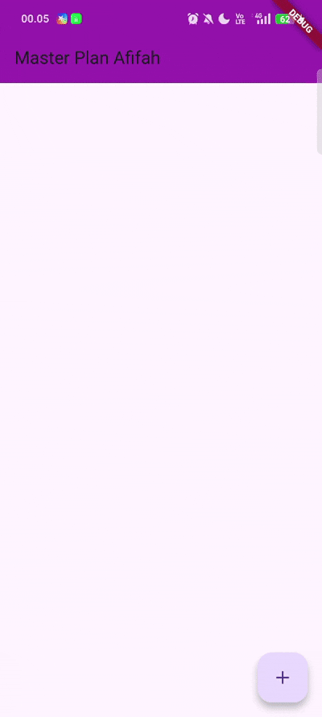
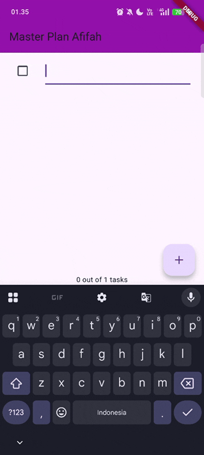

# DASAR STATE MANAGEMENT 🏟️

<table>
  <tr>
    <td><b>Nama</b></td>
    <td>:</td>
    <td>Afifah Khoirunnisa</td>
  </tr>
  <tr>
    <td><b>Kelas</b></td>
    <td>:</td>
    <td>TI-3G</td>
  </tr>
  <tr>
    <td><b>NIM</b></td>
    <td>:</td>
    <td>2341720250</td>
  </tr>
  <tr>
    <td><b>No. Abs</b></td>
    <td>:</td>
    <td>02</td>
  </tr>
</table>  

---

# PRAKTIKUM 1
## A. MODELS
## task.dart

```dart
  class Task {
    final String description;
    final bool complete;
    
    const Task({
      this.complete = false,
      this.description = '',
    });
  }
```

## data_layer.dart

```dart
  export 'plan.dart';
  export '../models/task.dart';
```

## B. VIEWS
## plan_screen.dart

```dart
  import 'data_layer.dart';
  import 'package:flutter/material.dart';

  class PlanScreen extends StatefulWidget {
    const PlanScreen({super.key});

    @override
    State createState() => _PlanScreenState();
  }

  class _PlanScreenState extends State<PlanScreen> {
    Plan plan = const Plan();

    @override
    Widget build(BuildContext context) {
      return Scaffold(
        // ganti ‘Namaku' dengan Nama panggilan Anda
        appBar: AppBar(
          backgroundColor: Colors.purple,
          title: const Text('Master Plan Afifah'),
        ),
        body: _buildList(),
        floatingActionButton: _buildAddTaskButton(),
      );
    }

    late ScrollController scrollController;

    @override
    void initState() {
      super.initState();
      scrollController = ScrollController()
        ..addListener(() {
          FocusScope.of(context).requestFocus(FocusNode());
        });
    }

    Widget _buildAddTaskButton() {
      return FloatingActionButton(
        child: const Icon(Icons.add),
        onPressed: () {
          setState(() {
            plan = Plan(
              name: plan.name,
              tasks: List<Task>.from(plan.tasks)..add(const Task()),
            );
          });
        },
      );
    }

    Widget _buildList() {
      return ListView.builder(
        controller: scrollController,
        keyboardDismissBehavior: Theme.of(context).platform ==
                TargetPlatform.iOS
            ? ScrollViewKeyboardDismissBehavior.onDrag
            : ScrollViewKeyboardDismissBehavior.manual,
        itemCount: plan.tasks.length,
        itemBuilder: (context, index) =>
            _buildTaskTile(plan.tasks[index], index),
      );
    }

    Widget _buildTaskTile(Task task, int index) {
      return ListTile(
        leading: Checkbox(
          value: task.complete,
          onChanged: (selected) {
            setState(() {
              plan = Plan(
                name: plan.name,
                tasks: List<Task>.from(plan.tasks)
                  ..[index] = Task(
                    description: task.description,
                    complete: selected ?? false,
                  ),
              );
            });
          },
        ),
        title: TextFormField(
          initialValue: task.description,
          onChanged: (text) {
            setState(() {
              plan = Plan(
                name: plan.name,
                tasks: List<Task>.from(plan.tasks)
                  ..[index] = Task(
                    description: text,
                    complete: task.complete,
                  ),
              );
            });
          },
        ),
      );
    }
  }
```

## plan.dart

```dart
  import '../models/task.dart';

  class Plan {
    final String name;
    final List<Task> tasks;
    
    const Plan({this.name = '', this.tasks = const []});
  }
``` 

## main.dart
```dart
import 'package:flutter/material.dart';
import '/views/plan_screen.dart';

void main() => runApp(MasterPlanApp());

class MasterPlanApp extends StatelessWidget {
  const MasterPlanApp({super.key});

  @override
  Widget build(BuildContext context) {
    return MaterialApp(
      theme: ThemeData(primarySwatch: Colors.purple),
      home: PlanScreen(),
    );
  }
}
```

# TUGAS PRAKTIKUM 1
**1. Jelaskan maksud dari langkah 4 pada praktikum tersebut! Mengapa dilakukan demikian?**

Artinya file data_layer.dart "mere-eksport" (re-export) semua simbol publik yang dieksport dari plan.dart dan ../models/task.dart. Jadi kalau file lain mengimpor data_layer.dart, ia otomatis mendapat akses ke kelas/fungsi/konstanta yang ada di kedua file itu tanpa harus mengimpor masing‑masing file secara terpisah.

**2. Mengapa perlu variabel plan di langkah 6 pada praktikum tersebut? Mengapa dibuat konstanta ?**

Variabel plan digunakan sebagai state utama yang menyimpan seluruh data tugas pada layar Master Plan, sehingga semua fitur seperti menambah, mengedit, dan menandai tugas bergantung padanya. Tanpa variabel ini, aplikasi tidak memiliki tempat untuk menyimpan atau memperbarui data. Nilai awalnya menggunakan const Plan() karena objek awal bersifat tetap dan immutable, serta mengikuti pola desain praktikum di mana setiap perubahan dibuat dengan menciptakan objek Plan baru, sehingga lebih efisien dan konsisten.

**3. Lakukan capture hasil dari Langkah 9 berupa GIF, kemudian jelaskan apa yang telah Anda buat!**


Kode _buildTaskTile berfungsi menampilkan satu tugas dalam bentuk ListTile yang berisi Checkbox dan TextFormField. Checkbox digunakan untuk menandai apakah tugas sudah selesai, sedangkan TextFormField dipakai untuk mengubah deskripsi tugas. Setiap kali pengguna mengubah checkbox atau teks, setState dipanggil untuk memperbarui tampilan. Karena objek Plan dan Task bersifat immutable, setiap perubahan dibuat dengan membuat objek baru, bukan mengubah yang lama. Daftar tugas lama disalin, kemudian elemen pada indeks yang sesuai diganti dengan versi Task yang telah diperbarui. Dengan pola ini, UI selalu konsisten dengan perubahan data yang terjadi.

**4. Apa kegunaan method pada Langkah 11 dan 13 dalam lifecyle state ?**

Method initState() digunakan saat state pertama kali dibuat untuk menginisialisasi scrollController dan menambahkan listener yang menutup keyboard ketika list di-scroll. Sementara itu, method dispose() dipanggil ketika widget dihapus dari tree untuk membersihkan scrollController agar tidak terjadi memory leak. Keduanya memastikan proses inisialisasi dan pembersihan berjalan aman dan efisien dalam lifecycle StatefulWidget.

# PRAKTIKUM 2
## PROVIDERS
## plan_providers.dart

```dart
  import 'package:flutter/material.dart';
  import '../models/data_layer.dart';

  class PlanProvider extends InheritedNotifier<ValueNotifier<Plan>> {
    const PlanProvider({super.key, required Widget child, required
    ValueNotifier<Plan> notifier})
    : super(child: child, notifier: notifier);

    static ValueNotifier<Plan> of(BuildContext context) {
    return context.
      dependOnInheritedWidgetOfExactType<PlanProvider>()!.notifier!;
    }
  }
```   

# TUGAS PRAKTIKUM 2
**1. Jelaskan mana yang dimaksud InheritedWidget pada langkah 1 tersebut! Mengapa yang digunakan InheritedNotifier?**

Yang termasuk InheritedWidget pada langkah 1 adalah:

```dart
class PlanProvider extends InheritedNotifier<ValueNotifier<Plan>> {
  const PlanProvider({
    super.key,
    required Widget child,
    required ValueNotifier<Plan> notifier,
  }) : super(child: child, notifier: notifier);
}
```

InheritedWidget adalah dasar sistem pewarisan data di Flutter,
sedangkan InheritedNotifier digunakan di sini karena kita ingin widget turunan otomatis rebuild saat Plan berubah.

**2. Jelaskan maksud dari method di langkah 3 pada praktikum tersebut! Mengapa dilakukan demikian?**
completedCount menghitung berapa banyak task selesai,
sedangkan completenessMessage membuat pesan ringkas untuk menampilkan progres daftar task tersebut.

Kode tersebut dijakankan untuk menunjukkan mana task yang selesai dan yang belum

**3. Lakukan capture hasil dari Langkah 9 berupa GIF, kemudian jelaskan apa yang telah Anda buat!**



# PRAKTIKUM 3
# TUGAS PRAKTIKUM 3