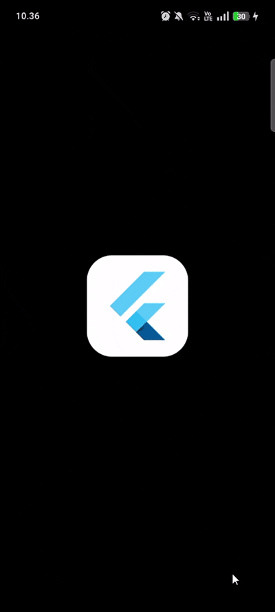
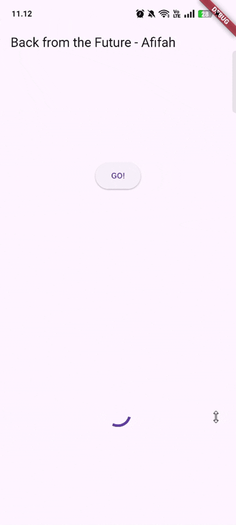
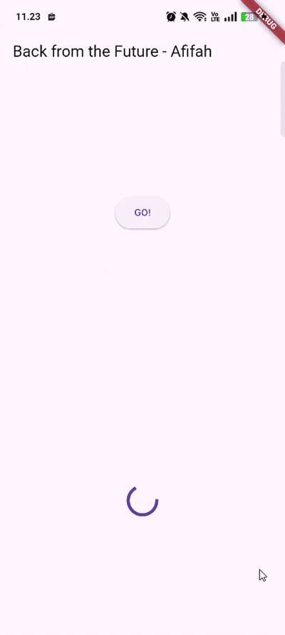
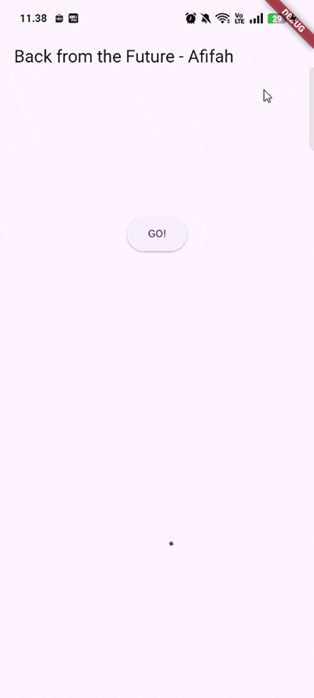
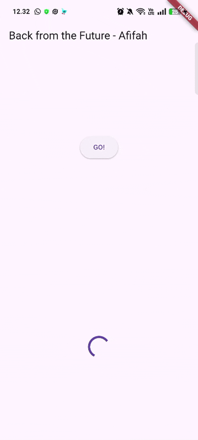
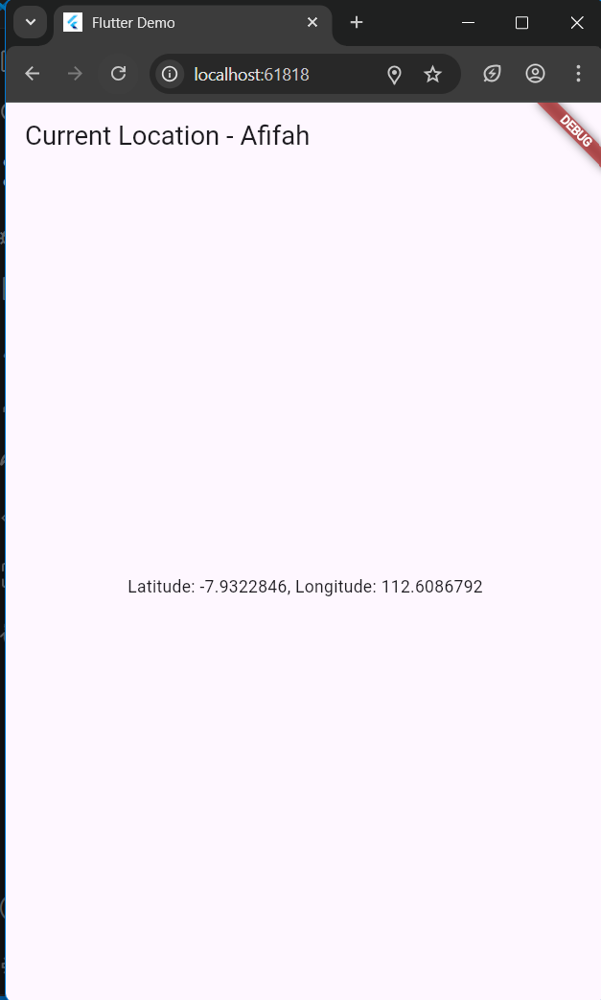
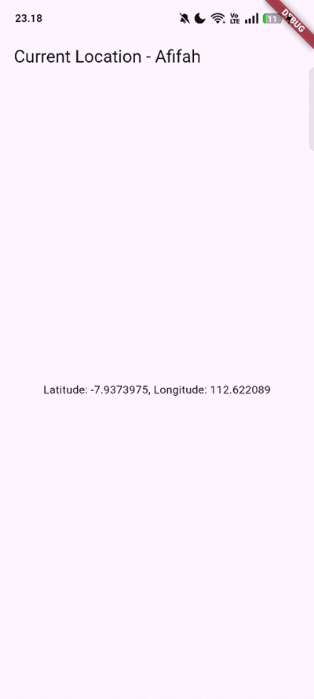
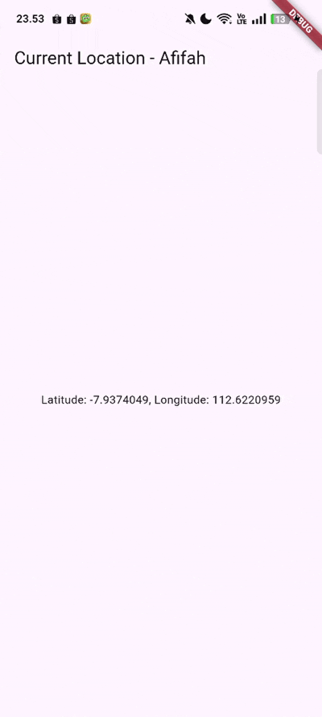
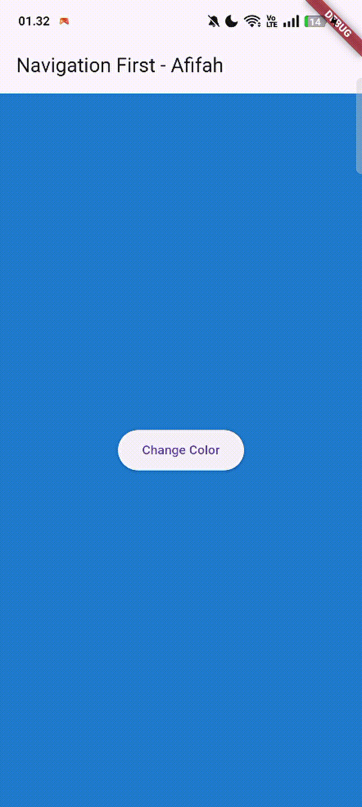
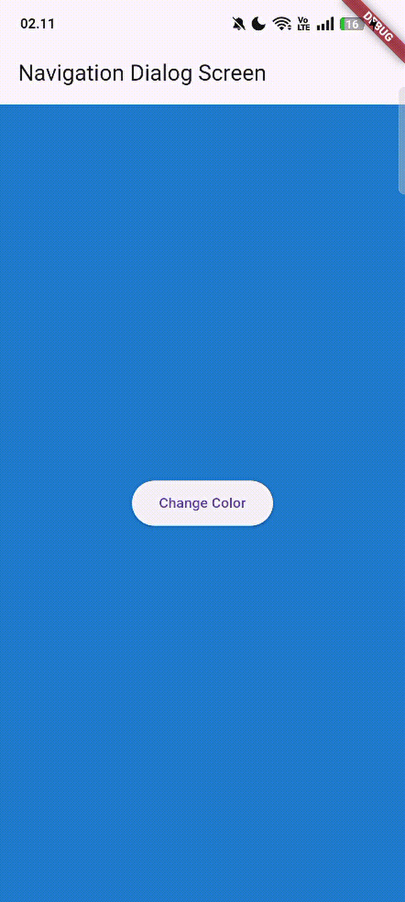

# PEMROGRAMAN ASYNCHRONOUS 🍕

<table>
  <tr>
    <td><b>Nama</b></td>
    <td>:</td>
    <td>Afifah Khoirunnisa</td>
  </tr>
  <tr>
    <td><b>Kelas</b></td>
    <td>:</td>
    <td>TI-3G</td>
  </tr>
  <tr>
    <td><b>NIM</b></td>
    <td>:</td>
    <td>2341720250</td>
  </tr>
  <tr>
    <td><b>No. Abs</b></td>
    <td>:</td>
    <td>02</td>
  </tr>
</table>  

---
# PRAKTIKUM 1
### main.dart
```dart
import 'package:flutter/material.dart';
import 'dart:async';
import 'package:http/http.dart';
import 'package:http/http.dart' as http;

void main() {
  runApp(const MyApp());
}

class MyApp extends StatelessWidget {
  const MyApp({super.key});

  // This widget is the root of your application.
  @override
  Widget build(BuildContext context) {
    return MaterialApp(
      title: 'Flutter Demo',
      theme: ThemeData(
        primarySwatch: Colors.blue,
        visualDensity: VisualDensity.adaptivePlatformDensity,
      ),
      home: const FuturePage(),
    );
  }
}

class FuturePage extends StatefulWidget {
  const FuturePage({super.key});

  @override
  State<FuturePage> createState() => _FuturePageState();
}

class _FuturePageState extends State<FuturePage> {
  String result = '';
  @override
  Widget build(BuildContext context) {
    return Scaffold(
      appBar: AppBar(title: const Text('Back from the Future - Afifah')),
      body: Center(
        child: Column(
          children: [
            const Spacer(),
            ElevatedButton(child: const Text('GO!'), onPressed: () {
              setState(() {});
              getData()
              .then((value){
                result = value.body.toString().substring(0, 450);
                setState(() {});
              }).catchError((_){
                result = 'An error occured';
                setState(() {
                });
              });
            }),
            const Spacer(),
            Text(result),
            const Spacer(),
            const CircularProgressIndicator(),
            const Spacer(),
          ],
        ),
      ),
    );
  }

  Future<Response> getData() async {
    const autority = 'www.googleapis.com';
    const path = '/books/v1/volumes/e-ZDDwAAQBAJ';
    Uri url = Uri.https(autority, path);
    return http.get(url);
  }
}
```

# SOAL
### **1. Tambahkan nama panggilan Anda pada title app sebagai identitas hasil pekerjaan Anda.**

```dart
lass _FuturePageState extends State<FuturePage> {
  String result = '';
  @override
  Widget build(BuildContext context) {
    return Scaffold(
      appBar: AppBar(title: const Text('Back from the Future - Afifah')),
      body: Center(
        child: Column(
          children: [
            const Spacer(),
            ElevatedButton(child: const Text('GO!'), onPressed: () {
              setState(() {});
              getData()
              .then((value){
                result = value.body.toString().substring(0, 450);
                setState(() {});
              }).catchError((_){
                result = 'An error occured';
                setState(() {
                });
              });
            }),
            const Spacer(),
            Text(result),
            const Spacer(),
            const CircularProgressIndicator(),
            const Spacer(),
          ],
        ),
      ),
    );
  }
  ```

### **2. Carilah judul buku favorit Anda di Google Books, lalu ganti ID buku pada variabel path di kode tersebut. Caranya ambil di URL browser Anda seperti gambar berikut ini.**
  ```dart
  Future<Response> getData() async {
    const autority = 'www.googleapis.com';
    const path = '/books/v1/volumes/e-ZDDwAAQBAJ';
    Uri url = Uri.https(autority, path);
    return http.get(url);
  }
  ```

### **Kemudian cobalah akses di browser URI tersebut dengan lengkap seperti ini. Jika menampilkan data JSON, maka Anda telah berhasil. Lakukan capture milik Anda dan tulis di README pada laporan praktikum. Lalu lakukan commit dengan pesan "W11: Soal 2".**

  

### **3. Jelaskan maksud kode langkah 5 tersebut terkait substring dan catchError!**

Dalam kode tersebut, fungsi substring(0, 450) digunakan untuk mengambil sebagian teks dari hasil respons API, yaitu 450 karakter pertama dari data yang diterima melalui value.body. Tujuannya agar teks yang ditampilkan di layar tidak terlalu panjang, karena respons dari API biasanya berbentuk JSON dengan ribuan karakter. Namun, pemanggilan substring seperti ini harus hati-hati, karena jika panjang string kurang dari 450 karakter, maka akan terjadi error RangeError (indeks di luar batas). Oleh karena itu, sebaiknya dilakukan pengecekan panjang string terlebih dahulu sebelum mengambil substring.

Sementara itu, bagian .catchError((_) { ... }) berfungsi untuk menangani kesalahan (error handling) yang mungkin terjadi selama proses asynchronous Future, seperti ketika koneksi internet terputus, URL salah, atau terjadi error lain pada bagian .then(). Jika terjadi kesalahan, blok catchError akan dijalankan dan variabel result diubah menjadi teks seperti 'An error occured', kemudian antarmuka pengguna diperbarui dengan setState() agar pesan tersebut muncul di layar. Dengan demikian, pengguna tetap mendapatkan umpan balik yang jelas ketika terjadi kegagalan. Secara keseluruhan, kombinasi substring dan catchError ini menunjukkan bagaimana Flutter menangani data dari API secara aman dan responsif terhadap kemungkinan error.

### **Capture hasil praktikum Anda berupa GIF dan lampirkan di README. Lalu lakukan commit dengan pesan "W11: Soal 3".**


# PRAKTIKUM 2

```dart
import 'package:flutter/material.dart';
import 'dart:async';
import 'package:http/http.dart';
import 'package:http/http.dart' as http;

void main() {
  runApp(const MyApp());
}

class MyApp extends StatelessWidget {
  const MyApp({super.key});

  // This widget is the root of your application.
  @override
  Widget build(BuildContext context) {
    return MaterialApp(
      title: 'Flutter Demo',
      theme: ThemeData(
        primarySwatch: Colors.blue,
        visualDensity: VisualDensity.adaptivePlatformDensity,
      ),
      home: const FuturePage(),
    );
  }
}

class FuturePage extends StatefulWidget {
  const FuturePage({super.key});

  @override
  State<FuturePage> createState() => _FuturePageState();
}

class _FuturePageState extends State<FuturePage> {
  String result = '';
  @override
  Widget build(BuildContext context) {
    return Scaffold(
      appBar: AppBar(title: const Text('Back from the Future - Afifah')),
      body: Center(
        child: Column(
          children: [
            const Spacer(),
            ElevatedButton(child: const Text('GO!'), onPressed: () {
              // setState(() {});
              // getData()
              // .then((value){
              //   result = value.body.toString().substring(0, 450);
              //   setState(() {});
              // }).catchError((_){
              //   result = 'An error occured';
              //   setState(() {
              //   });
              // });
              count();
            }),
            const Spacer(),
            Text(result),
            const Spacer(),
            const CircularProgressIndicator(),
            const Spacer(),
          ],
        ),
      ),
    );
  }

  Future<Response> getData() async {
    const autority = 'www.googleapis.com';
    const path = '/books/v1/volumes/e-ZDDwAAQBAJ';
    Uri url = Uri.https(autority, path);
    return http.get(url);
  }

  Future<int> returnOneAsync() async {
    await Future.delayed(const Duration(seconds: 3));
    return 1;
  }

  Future<int> returnTwoAsync() async {
    await Future.delayed(const Duration(seconds: 3));
    return 2;
  }

  Future<int> returnThreeAsync() async {
    await Future.delayed(const Duration(seconds: 3));
    return 3;
  }

  Future count() async {
    int total = 0;
    total = await returnOneAsync();
    total += await returnTwoAsync();
    total += await returnThreeAsync();
    setState(() {
      result = total.toString();
    });
  }
}
```

# SOAL
### **4. Jelaskan maksud kode langkah 1 dan 2 tersebut!**

Kode tersebut berfungsi untuk menunjukkan cara kerja proses asynchronous di Dart menggunakan Future dan async/await. Tiga fungsi — returnOneAsync(), returnTwoAsync(), dan returnThreeAsync() — masing-masing menunggu selama tiga detik menggunakan Future.delayed() sebelum mengembalikan nilai 1, 2, dan 3. Fungsi count() kemudian memanggil ketiga fungsi tersebut secara berurutan dengan await, menjumlahkan hasilnya menjadi total 6, lalu menampilkannya di antarmuka pengguna dengan setState(). Tujuan utamanya adalah mensimulasikan proses yang memerlukan waktu, seperti pengambilan data dari API, dan menunjukkan bagaimana Flutter menunggu hasil secara bertahap sebelum memperbarui tampilan.

### **Capture hasil praktikum Anda berupa GIF dan lampirkan di README. Lalu lakukan commit dengan pesan "W11: Soal 4".**



# PRAKTIKUM 3 - 1
### main.dart

```dart
import 'package:async/async.dart';

//tambahan di method class _FuturePageState
late Completer completer;

Future getNumber() {
  completer = Completer<int>();
  calculate();
  return completer.future;
}

Future calculate() async {
  await Future.delayed(const Duration(seconds : 5));
  completer.complete(42);
}

//ganti isi pada onPressed
getNumber().then((value) {
  setState(() {
    result = value.toString();
  });
});
```

## SOAL
### **5. Jelaskan maksud kode langkah 2 tersebut!**

Kode ini digunakan untuk menunjukkan bagaimana kita bisa membuat dan mengendalikan Future secara manual.
Alih-alih menulis return 42 langsung di dalam fungsi async, Completer memungkinkan kita untuk:

- membuat Future kosong dulu,
- lalu menyelesaikannya di waktu yang kita tentukan (misalnya setelah delay, event lain, atau kondisi tertentu).

### **Capture hasil praktikum Anda berupa GIF dan lampirkan di README. Lalu lakukan commit dengan pesan "W11: Soal 5".**



# PRAKTIKUM 3 - 2
### main.dart

```dart
// buat mthod calculate 2
Future calculate2() async {
    try {
      await new Future.delayed(const Duration(seconds : 5));
      completer.complete(42);
    } catch (_) {
      completer.completeError({});
    }
  }

//Ganti Kode On Pressed
getNumber().then((value) {
  setState(() {
    result = value.toString();
  });
}).catchError((e) {
  result = 'An error occurred';
});
```

# SOAL
### **6. Jelaskan maksud perbedaan kode langkah 2 dengan langkah 5-6 tersebut!**

Kode ini memperlihatkan bagaimana Completer bisa digunakan untuk membuat dan menyelesaikan Future secara manual, baik dengan hasil sukses maupun error.
calculate2() mengontrol logika penundaan dan penyelesaian, sedangkan tombol GO! menunjukkan bagaimana Flutter menunggu hasil Future tersebut, memperbarui tampilan UI sesuai apakah proses berhasil atau gagal.

### **Capture hasil praktikum Anda berupa GIF dan lampirkan di README. Lalu lakukan commit dengan pesan "W11: Soal 6".**



# PRAKTIKUM 4

### main.dart

```dart
//menambahkan kode ini
void returnFG(){
    FutureGroup<int> futureGroup = FutureGroup<int>();
    futureGroup.add(returnOneAsync());
    futureGroup.add(returnTwoAsync());
    futureGroup.add(returnThreeAsync());
    futureGroup.close();
    futureGroup.future.then((List<int> value) {
      int total = 0;
      for (var element in value) {
        total += element;
      }
      setState(() {
        result = total.toString();
      });
    });
  }

// mengganti bagian on pressed
ElevatedButton(child: const Text('GO!'), onPressed: () {
  returnFG();
}),
```

# SOAL
### **7. Capture hasil praktikum Anda berupa GIF dan lampirkan di README. Lalu lakukan commit dengan pesan "W11: Soal 7".**



### **8. Jelaskan maksud perbedaan kode langkah 1 dan 4!**

Keduanya sama-sama menjalankan banyak Future sekaligus dan menunggu hasil semuanya.
Perbedaan utamanya adalah:

- Gunakan Future.wait() kalau kamu sudah tahu semua Future-nya di awal (lebih simpel, tanpa import tambahan).
- Gunakan FutureGroup kalau kamu ingin menambahkan Future secara bertahap, misalnya dalam loop, event listener, atau kondisi dinamis sebelum akhirnya “menutup grup”.

# PRAKTIKUM 5
### main.dart

```dart
//menambahkan kode ini
Future returnError() async {
    await Future.delayed(const Duration(seconds: 2));
    throw Exception('Something terrible happened');
  }

// mengganti bagian ElevatedButton
ElevatedButton(
              child: const Text('GO!'),
              onPressed: () {
                returnError()
                .then((value){
                  setState(() {
                    result = 'Success';
                  });
                })
                .catchError((onError) {
                  setState(() {
                    result = onError.toString();
                  });
                }).whenComplete(() => print('Complete'));
              },
            ),
```

# SOAL
### **9. Capture hasil praktikum Anda berupa GIF dan lampirkan di README. Lalu lakukan commit dengan pesan "W11: Soal 9"**



### **10. Panggil method handleError() tersebut di ElevatedButton, lalu run. Apa hasilnya? Jelaskan perbedaan kode langkah 1 dan 4!**
Secara konseptual hasilnya sama, namun perbedaannya adalah:
- Struktur penulisan: .then().catchError() menggunakan method chaining, sedangkan async/await menggunakan alur imperatif yang lebih linear dan mudah dibaca.
- Penanganan error: .catchError() menangani error pada Future, sementara try/catch menangani error dengan gaya seperti synchronous code.
- Finally / completion: .whenComplete() selalu dijalankan setelah Future selesai di chaining, sedangkan finally dijalankan setelah blok try/catch selesai.
- Keterbacaan untuk banyak Future: async/await lebih mudah dibaca dan dikelola jika ada banyak Future, sementara chaining .then() bisa cepat membingungkan jika kompleks.


# PRAKTIKUM 6
### geolocation.dart

```dart
import 'package:flutter/material.dart';
import 'package:geolocator/geolocator.dart';

class LocationScreen extends StatefulWidget {
  const LocationScreen({super.key});

  @override
  _LocationScreenState createState() => _LocationScreenState();
}

class _LocationScreenState extends State<LocationScreen> {
  String myPosition = '';

  @override
  void initState() {
    super.initState();
    getPosition().then((Position myPos) {
      myPosition =
          'Latitude: ${myPos.latitude.toString()}, Longitude: ${myPos.longitude.toString()}';
      setState(() {
        myPosition = myPosition;
      });
    });
  }

  @override
  Widget build(BuildContext context) {
    final myWidget = myPosition == ' '
        ? const CircularProgressIndicator()
        : Text(myPosition);
    return Scaffold(
      appBar: AppBar(
        title: const Text('Current Location - Afifah'),
      ),
      body: Center(
        child: myWidget,
      ),
    );
  }

  Future<Position> getPosition() async {
    await Geolocator.requestPermission();
    await Geolocator.isLocationServiceEnabled();
    Position? position = 
        await Geolocator.getCurrentPosition();
    return position;
  }

}
```

# SOAL
### **11. Tambahkan nama panggilan Anda pada tiap properti title sebagai identitas pekerjaan Anda.**

```dart
Widget build(BuildContext context) {
    return Scaffold(
      appBar: AppBar(
        title: const Text('Current Location - Afifah'),
      ),
      body: Center(
        child: Text(myPosition),
      ),
    );
  }
```

### **12. Apakah Anda mendapatkan koordinat GPS ketika run di browser? Mengapa demikian?**



Tetap bisa jalan di browser. hal tersebut karena AndroidManifest.xml hanya berlaku untuk platform Android, sedangkan kalau kamu run Flutter di browser (Flutter Web), maka yang digunakan adalah API lokasi milik browser, bukan Android permission system.

**Capture hasil praktikum Anda berupa GIF dan lampirkan di README. Lalu lakukan commit dengan pesan "W11: Soal 12".**



# PRAKTIKUM 7
# SOAL
### **13. Apakah ada perbedaan UI dengan praktikum sebelumnya? Mengapa demikian?**
Perbedaan utama antara kode geolocation kamu yang sekarang dengan versi sebelumnya sebenarnya bukan pada hasil akhirnya, melainkan pada cara Flutter mengelola proses asynchronous dan pembaruan UI. Versi sekarang menggunakan FutureBuilder, di mana Flutter otomatis membangun ulang tampilan berdasarkan status Future (misalnya menampilkan indikator loading saat waiting dan hasil lokasi saat done), sehingga kamu tidak perlu memanggil setState() secara manual. Sebaliknya, versi sebelumnya menggunakan async/await dan setState, yang memberi kamu kendali penuh untuk menentukan kapan loading dimulai dan kapan hasil ditampilkan, tapi butuh variabel tambahan seperti isLoading. Jadi, meskipun terlihat hanya berbeda di bagian loading, mekanisme pengelolaan state dan waktu pembaruan UI-nya berbeda secara mendasar.

**Capture hasil praktikum Anda berupa GIF dan lampirkan di README. Lalu lakukan commit dengan pesan "W11: Soal 13".**



### **14. Apakah ada perbedaan UI dengan langkah sebelumnya? Mengapa demikian?**

Perbedaan utama antara kode awal sebelum ada tambahan error handling dan versi yang sekarang ini ada pada penanganan hasil Future di bagian FutureBuilder, bukan pada cara pengambilan lokasinya.

Pada versi awal, kode hanya menampilkan hasil ketika connectionState == done tanpa memeriksa apakah Future menghasilkan data valid atau error — jadi kalau terjadi error (misalnya user menolak izin lokasi atau layanan lokasi dimatikan), aplikasi bisa menampilkan null atau bahkan error di konsol tanpa pesan ke pengguna.


**Capture hasil praktikum Anda berupa GIF dan lampirkan di README. Lalu lakukan commit dengan pesan "W11: Soal 14".**


# PRAKTIKUM 8
# SOAL
### **15. Tambahkan nama panggilan Anda pada tiap properti title sebagai identitas pekerjaan Anda.**

```dart
@override
  Widget build(BuildContext context) {
    return Scaffold(
      backgroundColor: color,
      appBar: AppBar(title: const Text('Navigation First - Afifah')),
      body: Center(
        child: ElevatedButton(
          child: const Text('Change Color'),
          onPressed: () {
            _navigateAndGetColor(context);
          },
        ),
      ),
    );
  }
```
### **16. Cobalah klik setiap button, apa yang terjadi ? Mengapa demikian ?**

Setelah menekan tombol 'Change Color', kita akan diarahkan ke Navigation Second dimana kita diberi pilihan untuk mengganti background merah, hijau, dan biru. 

### **Gantilah 3 warna pada langkah 5 dengan warna favorit Anda!**

Saya mengganti warna pink, orange dan cokelat

### **Capture hasil praktikum Anda berupa GIF dan lampirkan di README. Lalu lakukan commit dengan pesan "W11: Soal 16".**



# PRAKTIKUM 9
### navigation_dialog.dart

```dart
import 'package:flutter/material.dart';

class NavigationDialogScreen extends StatefulWidget {
  const NavigationDialogScreen({super.key});

  @override
  _NavigationDialogScreenState createState() => _NavigationDialogScreenState();
}

class _NavigationDialogScreenState extends State<NavigationDialogScreen> {
  Color color = Colors.blue.shade700;

  @override
  Widget build(BuildContext context) {
    return Scaffold(
      backgroundColor: color,
      appBar: AppBar(title: const Text('Navigation Dialog Screen')),
      body: Center(
        child: ElevatedButton(
          child: const Text('Change Color'),
          onPressed: () {
            _showColorDialog(context);
          },
        ),
      ),
    );
  }

  _showColorDialog(BuildContext context) async {
    await showDialog(
      barrierDismissible: true,
      context: context,
      builder: (_) {
        return AlertDialog(
          title: const Text('Very important question'),
          content: const Text('Please choose a color'),
          actions: <Widget>[
            TextButton(
              child: const Text('Yellow'),
              onPressed: () {
                color = Colors.yellow.shade700;
                Navigator.pop(context);
              },
            ),
            TextButton(
              child: const Text('Purple'),
              onPressed: () {
                color = Colors.purple.shade700;
                Navigator.pop(context);
              },
            ),
            TextButton(
              child: const Text('Grey'),
              onPressed: () {
                color = Colors.grey.shade700;
                Navigator.pop(context);
              },
            ),
          ],
        );
      },
    );
    setState(() {});
  }
}
```

# SOAL
### **17. Soal 17. Cobalah klik setiap button, apa yang terjadi ? Mengapa demikian ?**
Setiap kali di klik 'change color', maka akan muncul pop ut yang menanyakan warna yang dipilih. Jika sudah, maka akan diterpkan ke background. Hal tersebut terjadi karena kita menggunakan file baru navigation dialog untuk melakukan hal tersebut.

### **Gantilah 3 warna pada langkah 3 dengan warna favorit Anda!**
Saya mengganti menjadi warna kuning, ungu, dan abu-abu.

### **Capture hasil praktikum Anda berupa GIF dan lampirkan di README. Lalu lakukan commit dengan pesan "W11: Soal 17".**
