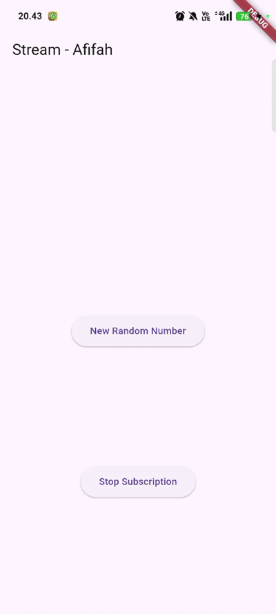

# LANJUTAN STATE MANAGEMENT DENGAN STREAMS 🎏

<table>
  <tr>
    <td><b>Nama</b></td>
    <td>:</td>
    <td>Afifah Khoirunnisa</td>
  </tr>
  <tr>
    <td><b>Kelas</b></td>
    <td>:</td>
    <td>TI-3G</td>
  </tr>
  <tr>
    <td><b>NIM</b></td>
    <td>:</td>
    <td>2341720250</td>
  </tr>
  <tr>
    <td><b>No. Abs</b></td>
    <td>:</td>
    <td>02</td>
  </tr>
</table>  

---
# PRAKTIKUM 1
### main.dart

```dart
import 'package:flutter/material.dart';

void main() {
  runApp(const MyApp());
}

class MyApp extends StatelessWidget {
  const MyApp({super.key});

  // This widget is the root of your application.
  @override
  Widget build(BuildContext context) {
    return MaterialApp(
      title: 'Stream - Afifah',
      theme: ThemeData(primarySwatch: Colors.purple),
      home: const StreamHomePage(),
    );
  }
}

class StreamHomePage extends StatefulWidget {
  const StreamHomePage({super.key});

  @override
  State<StreamHomePage> createState() => _StreamHomePageState();
}

class _StreamHomePageState extends State<StreamHomePage> {
  @override
  Widget build(BuildContext context) {
    return Container();
  }
}
```

### stream.dart

```dart
import 'package:flutter/material.dart';

class ColorStream{
  final List<Color> colors = [
    Colors.blueGrey,
    Colors.amber,
    Colors.deepPurple,
    Colors.lightBlue,
    Colors.teal,
    Colors.indigo,
    Colors.pink,
    Colors.orange,
    Colors.green,
    Colors.red
  ];

  Stream<Color> getColors() async* {
    yield* Stream.periodic(
      const Duration(seconds: 1), (int t) {
        int index = t % colors.length;
        return colors[index];
    });
  }
}
```

# SOAL
### **1. Tambahkan nama panggilan Anda pada title app sebagai identitas hasil pekerjaan Anda. Gantilah warna tema aplikasi sesuai kesukaan Anda.**

```dart
@override
  Widget build(BuildContext context) {
    return MaterialApp(
      title: 'Stream - Afifah',
      theme: ThemeData(primarySwatch: Colors.purple),
      home: const StreamHomePage(),
    );
  }
```

### **2. Tambahkan 5 warna lainnya sesuai keinginan Anda pada variabel colors tersebut.**

```dart
    Colors.indigo,
    Colors.pink,
    Colors.orange,
    Colors.green,
    Colors.red
```

### **3. Jelaskan fungsi keyword yield* pada kode tersebut! Apa maksud isi perintah kode tersebut?**
yield* digunakan untuk meneruskan semua data yang dihasilkan oleh Stream.periodic ke dalam stream getColors().
Fungsi ini mengirim satu warna setiap 1 detik. yield* hanya meneruskan warna-warna yang dibuat oleh Stream.periodic.
Index warna dibuat berulang (loop) dengan memakai operasi modulo.


### **4. Capture hasil praktikum Anda berupa GIF dan lampirkan di README.**


### **5. Jelaskan perbedaan menggunakan listen dan await for (langkah 9) !**
listen digunakan ketika kamu ingin mendengarkan Stream secara terus-menerus tanpa menghentikan alur program. Begitu ada data baru, callback-nya langsung dipanggil. Ini cocok kalau kamu ingin Stream berjalan di “background” dan UI tetap responsif, seperti contohmu yang langsung mengubah warna setiap kali Stream mengirim warna baru.

Sebaliknya, await for digunakan jika kamu ingin menunggu data Stream secara berurutan dalam alur async. Kode setelah await for tidak akan berjalan sampai seluruh Stream selesai. Ini seperti kamu “menonton” Stream dari awal sampai selesai, satu data per satu data, secara teratur. Jadi await for memblokir fungsi async tersebut sampai Stream selesai, sedangkan listen tidak memblokir dan membiarkan program berjalan sambil menerima event.

# PRAKTIKUM 2
### **6. Jelaskan maksud kode langkah 8 dan 10 tersebut!**
Langkah 8:
Pada langkah ini, widget sedang menyiapkan stream yang akan didengarkan.
1. numberStream = NumberStream();
Membuat objek stream khusus yang kamu rancang untuk mengirim angka.
2. numberStreamController = numberStream.controller;
Mengambil controller, yaitu alat untuk mengatur kapan data baru dikirim ke stream.
3. Stream stream = numberStreamController.stream;
Mengambil aliran datanya (stream-nya).
4. stream.listen((event) { ... })
Mulai mendengarkan stream.
Setiap ada angka baru yang dikirim (misalnya dari langkah 10), fungsi listen akan dipanggil.
5. setState(() { lastNumber = event; });
Angka yang diterima (event) disimpan ke variabel lastNumber, lalu UI diperbarui.

Langkah 10:
Pada langkah ini, fungsi membuat angka random dari 0 sampai 9. Angka tersebut kemudian dikirim ke stream melalui addNumberToSink(). Artinya, setiap kali fungsi ini dipanggil (misalnya saat menekan tombol), akan ada angka baru yang masuk ke stream.

### **Capture hasil praktikum Anda berupa GIF dan lampirkan di README.**


### **Soal 7. Jelaskan maksud kode langkah 13 sampai 15 tersebut!**

Pemanggilan addError() mengirimkan sebuah error event ke dalam stream menggunakan controller.sink.addError("error"). Artinya, aliran data tidak mengirim angka seperti biasa, tetapi mengirim sinyal bahwa terjadi kesalahan.

Bagian .onError((error) { ... }) adalah error handler pada sisi penerima stream. Ketika stream menerima error tadi, blok ini langsung dijalankan sebagai respon terhadap event error tersebut.

Dalam contoh ini, saat error muncul, nilai lastNumber diubah menjadi -1 lewat setState(), sehingga UI bisa menampilkan keadaan bahwa terjadi kesalahan.

# PRAKTIKUM 3
### **8. Jelaskan maksud kode langkah 1-3 tersebut!**

`StreamTransformer` digunakan untuk memproses aliran data **sebelum** data itu diterima oleh `listen()`. Pada contoh tersebut, setiap angka yang masuk akan di-*handle* oleh `handleData`, lalu diubah menjadi `value * 10` sebelum dikirim ke `sink`, sehingga listener selalu menerima nilai yang sudah dikali sepuluh. Jika terjadi error pada stream, `handleError` akan mengganti error itu dengan nilai `-1` agar aliran tetap dapat diproses tanpa crash. Ketika stream selesai, `handleDone` akan menutup sink. Setelah itu, barulah stream yang sudah ditransformasi tersebut didengarkan oleh `listen`, sehingga widget dapat memperbarui `lastNumber` sesuai hasil transformasi atau error yang sudah diubah menjadi `-1`.


### **Capture hasil praktikum Anda berupa GIF dan lampirkan di README.**


# PRAKTIKUM 4
### **9. Jelaskan maksud kode langkah 2, 6 dan 8 tersebut!**
Kode tersebut membuat *listener* pada `initState()` untuk memantau setiap data baru yang masuk ke stream, lalu memperbarui nilai `lastNumber` melalui `setState()` setiap kali ada event, menangani error dengan mengubah nilai menjadi `-1`, dan menampilkan pesan saat stream selesai lewat `onDone`. Pada fungsi `addRandomNumber()`, angka acak antara 0–9 dibuat dan hanya dikirim ke stream jika controllernya belum ditutup; jika stream sudah ditutup, nilai `lastNumber` langsung diubah menjadi `-1` sebagai tanda bahwa stream tidak bisa menerima data lagi. Dengan alur ini, widget bisa terus memperbarui tampilan berdasarkan data stream sambil tetap aman dari error karena stream yang sudah ditutup.

### **Capture hasil praktikum Anda berupa GIF dan lampirkan di README.**


### **10. Jelaskan mengapa error itu bisa terjadi?**
Error “Bad state: Stream has already been listened to.” muncul karena Stream yang bersifat single-subscription hanya boleh di-listen sekali. Jika mencoba memanggil .listen() lagi pada stream yang sama, Flutter langsung melempar error tersebut.

### **11. Jelaskan mengapa hal itu bisa terjadi ?**
Itu terjadi karena *stream*-nya diubah menjadi **broadcast stream**, lalu dipasang **dua listener** (`subscription` dan `subscription2`) yang **keduanya menerima data yang sama**. Pada *single-subscription stream*, hanya satu listener yang boleh mendengarkan, tetapi ketika di-*broadcast*, setiap listener baru akan menerima semua event yang masuk. Jadi, setiap kali `addRandomNumber()` mengirim satu angka, stream broadcast akan menyalurkannya ke dua listener, sehingga callback dijalankan **dua kali**, dan nilai `values` bertambah dua kali untuk setiap event yang sama.

### **Capture hasil praktikum Anda berupa GIF dan lampirkan di README.**


# PRAKTIKUM 6
### main.dart

```dart
import 'package:flutter/material.dart';
import 'stream.dart';
import 'dart:async';

void main() {
  runApp(const MyApp());
}

class MyApp extends StatelessWidget {
  const MyApp({super.key});

  @override
  Widget build(BuildContext context) {
    return MaterialApp(
      title: 'Stream - Afifah',
      theme: ThemeData(
        colorScheme: ColorScheme.fromSeed(seedColor: Colors.deepPurple),
      ),
      home: const StreamHomePage(title: 'Strem - Afifah',),
    );
  }
}

class StreamHomePage extends StatefulWidget {
  const StreamHomePage({super.key, required this.title});

  final String title;

  @override
  State<StreamHomePage> createState() => _StreamHomePageState();
}

class _StreamHomePageState extends State<StreamHomePage> {
  @override
  Widget build(BuildContext context) {
    return Scaffold(
      appBar: AppBar(title: const Text('Stream - Afifah')),
      body: StreamBuilder(
        stream: numberStream,
        initialData: 0,
        builder: (context, snapshot) {
          if (snapshot.hasError) {
            print('Error');
          }
          if (snapshot.hasData) {
            return Center(
              child: Text(
                snapshot.data.toString(),
                style: const TextStyle(fontSize: 96),
              ),
            );
          } else {
            return const SizedBox.shrink();
          }
        },
      ),
    );
  }

  late Stream<int> numberStream;
  @override
  void initState() {
    numberStream = NumberStream().getNumbers();
    super.initState();
  }
}
```

### stream.dart

```dart
import 'dart:math';

class NumberStream{
  Stream<int> getNumbers() async* {
    yield* Stream.periodic(const Duration(seconds: 1), (int t) {
      Random random = Random();
      int myNum = random.nextInt(10);
      return myNum;
    });
  }
}
```

### **Jelaskan maksud kode pada langkah 3 dan 7 !**
Langkah 3:
Kode tersebut membuat sebuah stream yang memancarkan (meng-emit ) angka acak setiap 1 detik. Fungsi getNumbers() adalah async generator yang mengembalikan Stream<int>. Di dalamnya, digunakan yield* untuk “meneruskan” aliran data dari Stream.periodic(), yaitu stream yang secara otomatis berjalan setiap durasi tertentu. Pada setiap detik (Duration(seconds: 1)), callback Stream.periodic dijalankan, membuat angka acak baru dengan Random().nextInt(10) lalu mengembalikannya. Hasilnya, siapa pun yang melakukan listen pada stream ini akan menerima angka acak baru setiap 1 detik secara terus-menerus.

Langkah 7:
Kode StreamBuilder tersebut berfungsi untuk membangun tampilan UI berdasarkan data terbaru yang dikirim oleh sebuah Stream. StreamBuilder akan memantau numberStream, dan setiap kali stream mengirim nilai baru, builder akan dipanggil ulang untuk memperbarui tampilan. initialData: 0 berarti sebelum stream mengirim data pertama, nilai awal yang ditampilkan adalah 0. Di dalam builder, snapshot berisi data terbaru dari stream: jika terjadi error, bagian snapshot.hasError dijalankan; jika ada data (snapshot.hasData), widget menampilkan angka tersebut dalam teks besar; dan jika belum ada data sama sekali, akan mengembalikan widget kecil SizedBox.shrink() sebagai placeholder. Dengan kata lain, StreamBuilder membuat UI selalu sinkron dengan data stream secara otomatis dan real-time.

### **Capture hasil praktikum Anda berupa GIF dan lampirkan di README.**


