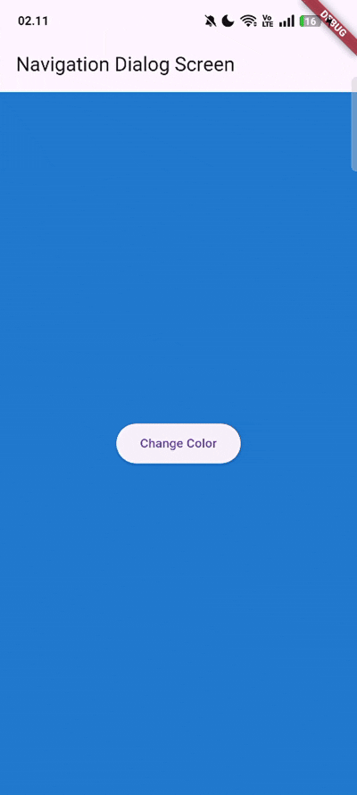

# LANJUTAN STATE MANAGEMENT DENGAN STREAMS 🎏

<table>
  <tr>
    <td><b>Nama</b></td>
    <td>:</td>
    <td>Afifah Khoirunnisa</td>
  </tr>
  <tr>
    <td><b>Kelas</b></td>
    <td>:</td>
    <td>TI-3G</td>
  </tr>
  <tr>
    <td><b>NIM</b></td>
    <td>:</td>
    <td>2341720250</td>
  </tr>
  <tr>
    <td><b>No. Abs</b></td>
    <td>:</td>
    <td>02</td>
  </tr>
</table>  

---
# PRAKTIKUM 1
### main.dart

```dart
import 'package:flutter/material.dart';

void main() {
  runApp(const MyApp());
}

class MyApp extends StatelessWidget {
  const MyApp({super.key});

  // This widget is the root of your application.
  @override
  Widget build(BuildContext context) {
    return MaterialApp(
      title: 'Stream - Afifah',
      theme: ThemeData(primarySwatch: Colors.purple),
      home: const StreamHomePage(),
    );
  }
}

class StreamHomePage extends StatefulWidget {
  const StreamHomePage({super.key});

  @override
  State<StreamHomePage> createState() => _StreamHomePageState();
}

class _StreamHomePageState extends State<StreamHomePage> {
  @override
  Widget build(BuildContext context) {
    return Container();
  }
}
```

### stream.dart

```dart
import 'package:flutter/material.dart';

class ColorStream{
  final List<Color> colors = [
    Colors.blueGrey,
    Colors.amber,
    Colors.deepPurple,
    Colors.lightBlue,
    Colors.teal,
    Colors.indigo,
    Colors.pink,
    Colors.orange,
    Colors.green,
    Colors.red
  ];

  Stream<Color> getColors() async* {
    yield* Stream.periodic(
      const Duration(seconds: 1), (int t) {
        int index = t % colors.length;
        return colors[index];
    });
  }
}
```

# SOAL
### 1. Tambahkan nama panggilan Anda pada title app sebagai identitas hasil pekerjaan Anda. Gantilah warna tema aplikasi sesuai kesukaan Anda.

```dart
@override
  Widget build(BuildContext context) {
    return MaterialApp(
      title: 'Stream - Afifah',
      theme: ThemeData(primarySwatch: Colors.purple),
      home: const StreamHomePage(),
    );
  }
```

### 2. Tambahkan 5 warna lainnya sesuai keinginan Anda pada variabel colors tersebut.

```dart
    Colors.indigo,
    Colors.pink,
    Colors.orange,
    Colors.green,
    Colors.red
```

### 3. Jelaskan fungsi keyword yield* pada kode tersebut! Apa maksud isi perintah kode tersebut?
yield* digunakan untuk meneruskan semua data yang dihasilkan oleh Stream.periodic ke dalam stream getColors().
Fungsi ini mengirim satu warna setiap 1 detik. yield* hanya meneruskan warna-warna yang dibuat oleh Stream.periodic.
Index warna dibuat berulang (loop) dengan memakai operasi modulo.


### 4. Capture hasil praktikum Anda berupa GIF dan lampirkan di README.



### 5. Jelaskan perbedaan menggunakan listen dan await for (langkah 9) !
listen digunakan ketika kamu ingin mendengarkan Stream secara terus-menerus tanpa menghentikan alur program. Begitu ada data baru, callback-nya langsung dipanggil. Ini cocok kalau kamu ingin Stream berjalan di “background” dan UI tetap responsif, seperti contohmu yang langsung mengubah warna setiap kali Stream mengirim warna baru.

Sebaliknya, await for digunakan jika kamu ingin menunggu data Stream secara berurutan dalam alur async. Kode setelah await for tidak akan berjalan sampai seluruh Stream selesai. Ini seperti kamu “menonton” Stream dari awal sampai selesai, satu data per satu data, secara teratur. Jadi await for memblokir fungsi async tersebut sampai Stream selesai, sedangkan listen tidak memblokir dan membiarkan program berjalan sambil menerima event.