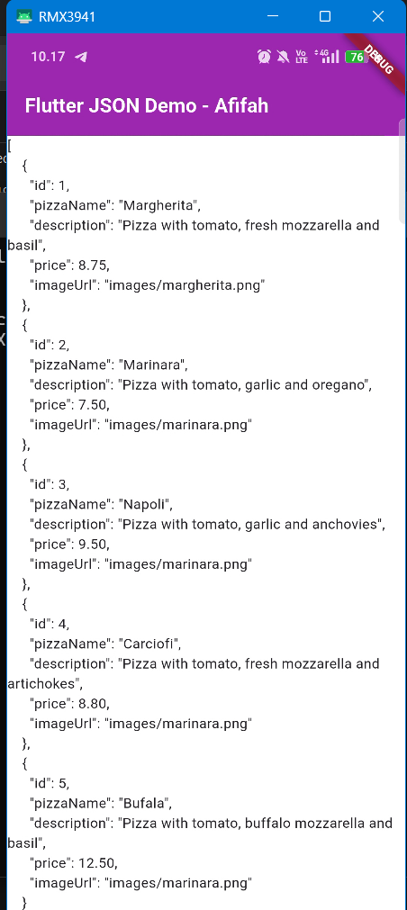
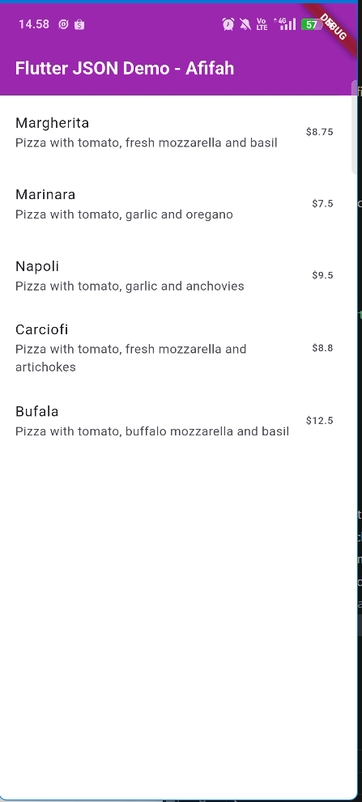
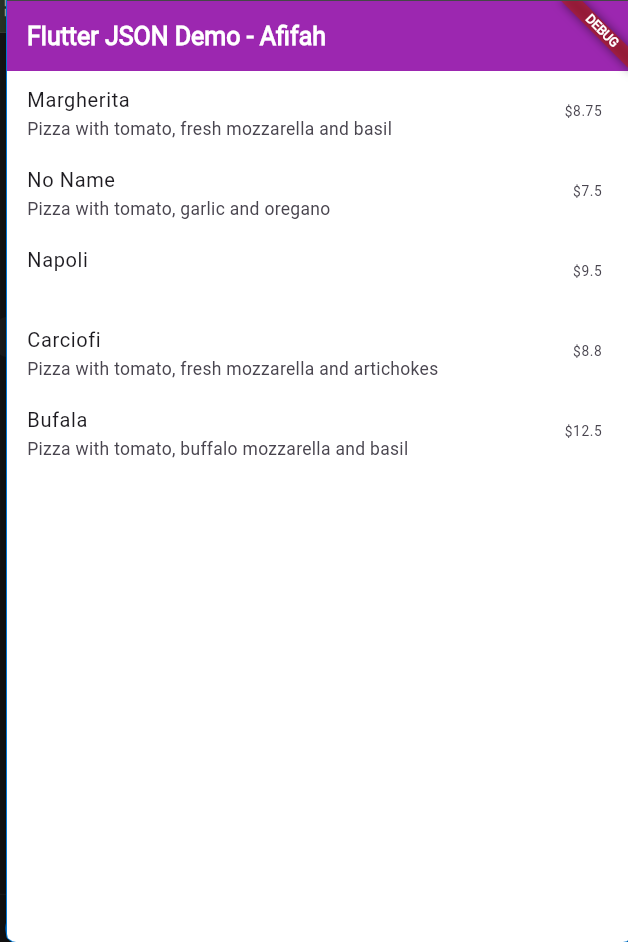
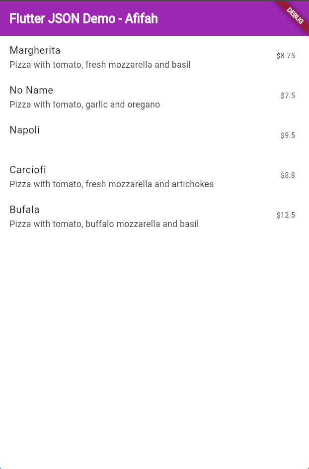
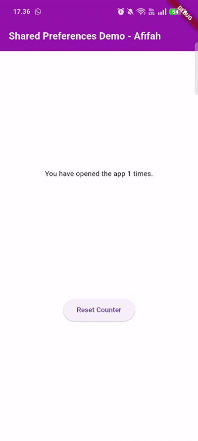
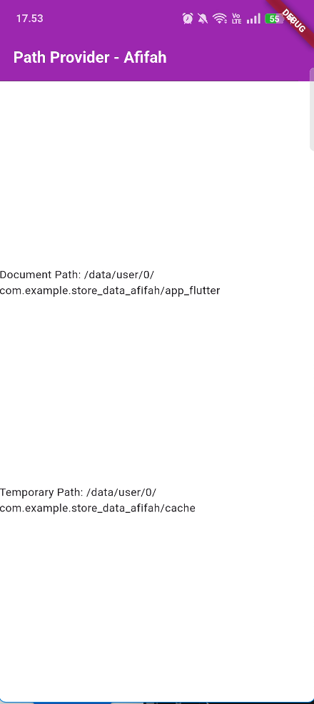
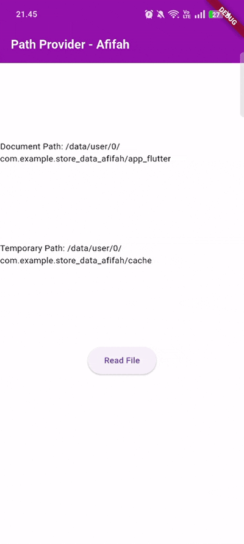
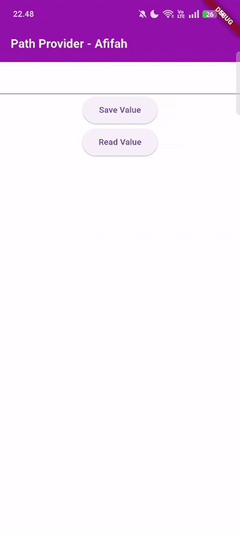

# PERSISTENSI DATA 📑

<table>
  <tr>
    <td><b>Nama</b></td>
    <td>:</td>
    <td>Afifah Khoirunnisa</td>
  </tr>
  <tr>
    <td><b>Kelas</b></td>
    <td>:</td>
    <td>TI-3G</td>
  </tr>
  <tr>
    <td><b>NIM</b></td>
    <td>:</td>
    <td>2341720250</td>
  </tr>
  <tr>
    <td><b>No. Abs</b></td>
    <td>:</td>
    <td>02</td>
  </tr>
</table>  

---

# PRAKTIKUM 1

### main.dart

```dart
import 'package:flutter/material.dart';

void main() {
  runApp(const MyApp());
}

class MyApp extends StatelessWidget {
  const MyApp({super.key});

  @override
  Widget build(BuildContext context) {
    return MaterialApp(
      title: 'Flutter JSON Demo - Afifah',
      theme: ThemeData(
        colorScheme: ColorScheme.fromSeed(seedColor: Colors.deepPurple),
      ),
      home: const MyHomePage(),
    );
  }
}

class MyHomePage extends StatefulWidget {
  const MyHomePage({super.key});

  @override
  State<MyHomePage> createState() => _MyHomePageState();
}

class _MyHomePageState extends State<MyHomePage> {
  @override
  Widget build(BuildContext context) {
    return Scaffold(
      appBar: AppBar(
        title: const Text('Flutter JSON Demo - Afifah'),
      ),
      body: Container(),
    );
  }
}
```

### **1. Tambahkan nama panggilan Anda pada title app sebagai identitas hasil pekerjaan Anda.**
```dart
@override
  Widget build(BuildContext context) {
    return MaterialApp(
      title: 'Flutter JSON Demo - Afifah',
      theme: ThemeData(
        colorScheme: ColorScheme.fromSeed(seedColor: Colors.deepPurple),
      ),
      home: const MyHomePage(),
    );
  }
```

### **Gantilah warna tema aplikasi sesuai kesukaan Anda.**

```dart
@override
  Widget build(BuildContext context) {
    return MaterialApp(
      title: 'Flutter JSON Demo - Afifah',
      theme: ThemeData(
        scaffoldBackgroundColor: Colors.white, // background putih
        appBarTheme: const AppBarTheme(
          backgroundColor: Colors.purple, // AppBar biru
          elevation: 0,
          titleTextStyle: TextStyle(
            color: Colors.white,         
            fontSize: 20,
            fontWeight: FontWeight.bold,
          ),
        ),
      ),
      home: const MyHomePage(),
    );
  }
```

# PRAKTIKUM 1 - 2

### main.dart

```dart
import 'package:flutter/material.dart';

void main() {
  runApp(const MyApp());
}

class MyApp extends StatelessWidget {
  const MyApp({super.key});

  @override
  Widget build(BuildContext context) {
    return MaterialApp(
      title: 'Flutter JSON Demo - Afifah',
      theme: ThemeData(
        scaffoldBackgroundColor: Colors.white, // background putih
        appBarTheme: const AppBarTheme(
          backgroundColor: Colors.purple, // AppBar biru
          elevation: 0,
          titleTextStyle: TextStyle(
            color: Colors.white,         
            fontSize: 20,
            fontWeight: FontWeight.bold,
          ),
        ),
      ),
      home: const MyHomePage(),
    );
  }
}

class MyHomePage extends StatefulWidget {
  const MyHomePage({super.key});

  @override
  State<MyHomePage> createState() => _MyHomePageState();
}

class _MyHomePageState extends State<MyHomePage> {
  String pizzaString = ' ';

  @override
  void initState() {
    super.initState();
    readJsonFile();
  }

  Future readJsonFile() async {
    String myString =
        await DefaultAssetBundle.of(context).loadString('assets/pizzalist.json');
    setState(() {
      pizzaString = myString;
    });
  }

  @override
  Widget build(BuildContext context) {
    return Scaffold(
      appBar: AppBar(title: const Text('Flutter JSON Demo - Afifah')),
      body: Text(pizzaString),
    );
  }
}

```

### pizzalist.json

```json
[ 
    { 
      "id": 1, 
      "pizzaName": "Margherita", 
      "description": "Pizza with tomato, fresh mozzarella and basil",
      "price": 8.75, 
      "imageUrl": "images/margherita.png" 
    }, 
    { 
      "id": 2, 
      "pizzaName": "Marinara", 
      "description": "Pizza with tomato, garlic and oregano",
      "price": 7.50, 
      "imageUrl": "images/marinara.png"  
    }, 
    { 
      "id": 3, 
      "pizzaName": "Napoli", 
      "description": "Pizza with tomato, garlic and anchovies",
      "price": 9.50, 
      "imageUrl": "images/marinara.png"  
    }, 
    { 
      "id": 4, 
      "pizzaName": "Carciofi", 
      "description": "Pizza with tomato, fresh mozzarella and artichokes",
      "price": 8.80, 
      "imageUrl": "images/marinara.png"  
    }, 
    { 
      "id": 5, 
      "pizzaName": "Bufala", 
      "description": "Pizza with tomato, buffalo mozzarella and basil",
      "price": 12.50, 
      "imageUrl": "images/marinara.png"  
    }
]
```

### **2. Masukkan hasil capture layar ke laporan praktikum Anda.**


# PRAKTIKUM 1-3
### main.dart
```dart
import 'dart:convert';
import 'package:flutter/material.dart';
import './model/pizza.dart';

void main() {
  runApp(const MyApp());
}

class MyApp extends StatelessWidget {
  const MyApp({super.key});

  @override
  Widget build(BuildContext context) {
    return MaterialApp(
      title: 'Flutter JSON Demo - Afifah',
      theme: ThemeData(
        scaffoldBackgroundColor: Colors.white, // background putih
        appBarTheme: const AppBarTheme(
          backgroundColor: Colors.purple, 
          elevation: 0,
          titleTextStyle: TextStyle(
            color: Colors.white,
            fontSize: 20,
            fontWeight: FontWeight.bold,
          ),
        ),
      ),
      home: const MyHomePage(),
    );
  }
}

class MyHomePage extends StatefulWidget {
  const MyHomePage({super.key});

  @override
  State<MyHomePage> createState() => _MyHomePageState();
}

class _MyHomePageState extends State<MyHomePage> {
  String pizzaString = ' ';

  @override
  void initState() {
    super.initState();
    readJsonFile().then((value) {
      setState(() {
        myPizzas = value;
      });
    });
  }

  @override
  Widget build(BuildContext context) {
    return Scaffold(
      appBar: AppBar(title: const Text('Flutter JSON Demo - Afifah')),
      body: ListView.builder(
        itemCount: myPizzas.length,
        itemBuilder: (context, index) {
          return ListTile(
            // leading: Image.network(myPizzas[index].pizzaName),
            title: Text(myPizzas[index].pizzaName),
            subtitle: Text(myPizzas[index].description),
            trailing: Text('\$${myPizzas[index].price}'),
          );
        },
      ),
    );
  }

  Future readJsonFile() async {
    String myString = await DefaultAssetBundle.of(
      context,
    ).loadString('assets/pizzalist.json');
    List pizzaMapList = jsonDecode(myString);

    List<Pizza> myPizzas = [];
    for (var pizza in pizzaMapList) {
      Pizza myPizza = Pizza.fromJson(pizza);
      myPizzas.add(myPizza);
    }

    return myPizzas;
  }

  List<Pizza> myPizzas = [];

  
}
```

### pizza.dart
```dart
class Pizza {
  final int id;
  final String pizzaName;
  final String description;
  final double? price;
  final String imageUrl;

  Pizza.fromJson(Map<String, dynamic> json)
    : id = json['id'],
      pizzaName = json['pizzaName'],
      description = json['description'],
      price = json['price'],
      imageUrl = json['imageUrl'];
}
```

### **3. Masukkan hasil capture layar ke laporan praktikum Anda.**


# PRAKTIKUM 2
### **4. Capture hasil running aplikasi Anda, kemudian impor ke laporan praktikum Anda!**


# PRAKTIKUM 3
### pizza.dart

```dart
const keyId = 'id';
const keyName = 'pizzaName';
const keyDescription = 'description';
const keyPrice = 'price';
const keyImageUrl = 'imageUrl';

class Pizza {
  final int id;
  final String pizzaName;
  final String description;
  final double? price;
  final String imageUrl;

  Pizza.fromJson(Map<String, dynamic> json)
    : id = int.tryParse(json[keyId].toString()) ?? 0,
      pizzaName = json[keyName] != null
          ? json[keyName].toString()
          : 'No Name',
      description = json[keyDescription] != null
          ? json[keyDescription].toString()
          : '',
      price = double.tryParse(json[keyPrice].toString()) ?? 0.0,
      imageUrl = json[keyImageUrl] ?? '';

  Map<String, dynamic> toJson() {
    return {
      keyId: id,
      keyName: pizzaName,
      keyDescription: description,
      keyPrice: price,
      keyImageUrl: imageUrl,
    };
  }
}
```

### ** 5. Jelaskan maksud kode lebih safe dan maintainable!**

✔ Karena pakai konstanta → aman dari typo, mudah diubah
✔ Karena pakai OOP → struktur data rapi, reusable
✔ Karena parsing terpusat di satu class → mudah diperbaiki
✔ Karena ada default value & tryParse → aplikasi tidak mudah crash

### **Capture hasil praktikum Anda dan lampirkan di README.**


# PRAKTIKUM 4
### main.dart
```dart
import 'dart:convert';
import 'package:flutter/material.dart';
import './model/pizza.dart';
import 'package:shared_preferences/shared_preferences.dart';

void main() {
  runApp(const MyApp());
}

class MyApp extends StatelessWidget {
  const MyApp({super.key});

  @override
  Widget build(BuildContext context) {
    return MaterialApp(
      title: 'Shared Preferences Demo - Afifah',
      theme: ThemeData(
        scaffoldBackgroundColor: Colors.white, // background putih
        appBarTheme: const AppBarTheme(
          backgroundColor: Colors.purple,
          elevation: 0,
          titleTextStyle: TextStyle(
            color: Colors.white,
            fontSize: 20,
            fontWeight: FontWeight.bold,
          ),
        ),
      ),
      home: const MyHomePage(),
    );
  }
}

class MyHomePage extends StatefulWidget {
  const MyHomePage({super.key});

  @override
  State<MyHomePage> createState() => _MyHomePageState();
}

class _MyHomePageState extends State<MyHomePage> {
  // String pizzaString = ' ';

  // @override
  // void initState() {
  //   super.initState();
  //   readJsonFile().then((value) {
  //     setState(() {
  //       myPizzas = value;
  //     });
  //   });
  // }

  @override
  Widget build(BuildContext context) {
    return Scaffold(
      appBar: AppBar(title: const Text('Shared Preferences Demo - Afifah')),
      body: Center(
        child: Column(
          mainAxisAlignment: MainAxisAlignment.spaceEvenly,
          children: [
            Text('You have opened the app $appCounter times.'),
            ElevatedButton(
              onPressed: () {
                deletePreference();
              }, child: const Text('Reset Counter')),
          ],
        ),
      ),
    );
  }

  int appCounter = 0;

  Future readAndWritePreference() async {
    SharedPreferences prefs = await SharedPreferences.getInstance();
    appCounter = (prefs.getInt('counter') ?? 0);
    appCounter++;
    await prefs.setInt('appCounter', appCounter);
    setState(() {
      appCounter = appCounter;
    });
  }

  @override
  void initState() {
    super.initState();
    readAndWritePreference();
  }

  Future deletePreference() async {
    SharedPreferences prefs = await SharedPreferences.getInstance();
    await prefs.clear();
    setState(() {
      appCounter = 0;
    });
  }
}
```

### **6. Capture hasil praktikum Anda berupa GIF dan lampirkan di README.**


# PRAKTIKUM 5
### main.dart
```dart
import 'dart:convert';
import 'package:flutter/material.dart';
import './model/pizza.dart';
import 'package:shared_preferences/shared_preferences.dart';
import 'package:path_provider/path_provider.dart';

void main() {
  runApp(const MyApp());
}

class MyApp extends StatelessWidget {
  const MyApp({super.key});

  @override
  Widget build(BuildContext context) {
    return MaterialApp(
      title: 'Shared Preferences Demo - Afifah',
      theme: ThemeData(
        scaffoldBackgroundColor: Colors.white, // background putih
        appBarTheme: const AppBarTheme(
          backgroundColor: Colors.purple,
          elevation: 0,
          titleTextStyle: TextStyle(
            color: Colors.white,
            fontSize: 20,
            fontWeight: FontWeight.bold,
          ),
        ),
      ),
      home: const MyHomePage(),
    );
  }
}

class MyHomePage extends StatefulWidget {
  const MyHomePage({super.key});

  @override
  State<MyHomePage> createState() => _MyHomePageState();
}

class _MyHomePageState extends State<MyHomePage> {
  String documentPath = '';
  String tempPath = '';

  @override
  Widget build(BuildContext context) {
    return Scaffold(
      appBar: AppBar(title: const Text('Path Provider - Afifah')),
      body: Column(
        mainAxisAlignment: MainAxisAlignment.spaceEvenly,
        children: [
          Text('Document Path: $documentPath'),
          Text('Temporary Path: $tempPath'),
        ],
      ),
    );
  }

  int appCounter = 0;

  Future readAndWritePreference() async {
    SharedPreferences prefs = await SharedPreferences.getInstance();
    appCounter = (prefs.getInt('counter') ?? 0);
    appCounter++;
    await prefs.setInt('appCounter', appCounter);
    setState(() {
      appCounter = appCounter;
    });
  }

  @override
  void initState() {
    super.initState();
    getPaths();
  }

  Future deletePreference() async {
    SharedPreferences prefs = await SharedPreferences.getInstance();
    await prefs.clear();
    setState(() {
      appCounter = 0;
    });
  }

  Future getPaths() async {
    final docDir = await getApplicationDocumentsDirectory();
    final tempDir = await getTemporaryDirectory();
    setState(() {
      documentPath = docDir.path;
      tempPath = tempDir.path;
    });
  }
}
```

### ** 7.Capture hasil praktikum Anda dan lampirkan di README


# PRAKTIKUM 6
### main.dart

```dart
import 'dart:convert';
import 'package:flutter/material.dart';
import './model/pizza.dart';
import 'package:shared_preferences/shared_preferences.dart';
import 'package:path_provider/path_provider.dart';
import 'dart:io';

void main() {
  runApp(const MyApp());
}

class MyApp extends StatelessWidget {
  const MyApp({super.key});

  @override
  Widget build(BuildContext context) {
    return MaterialApp(
      title: 'Shared Preferences Demo - Afifah',
      theme: ThemeData(
        scaffoldBackgroundColor: Colors.white, // background putih
        appBarTheme: const AppBarTheme(
          backgroundColor: Colors.purple,
          elevation: 0,
          titleTextStyle: TextStyle(
            color: Colors.white,
            fontSize: 20,
            fontWeight: FontWeight.bold,
          ),
        ),
      ),
      home: const MyHomePage(),
    );
  }
}

class MyHomePage extends StatefulWidget {
  const MyHomePage({super.key});

  @override
  State<MyHomePage> createState() => _MyHomePageState();
}

class _MyHomePageState extends State<MyHomePage> {
  String documentPath = '';
  String tempPath = '';
  late File myFile;
  String fileText = '';
  
  @override
  Widget build(BuildContext context) {
    return Scaffold(
      appBar: AppBar(title: const Text('Path Provider - Afifah')),
      body: Column(
        mainAxisAlignment: MainAxisAlignment.spaceEvenly,
        children: [
          Text('Document Path: $documentPath'),
          Text('Temporary Path: $tempPath'), 
        ElevatedButton (
          child: const Text ('Read File'),
          onPressed: () => readFile(),
        ),
        Text(fileText),
      ],
      ),
    );
  }

  int appCounter = 0;

  Future readAndWritePreference() async {
    SharedPreferences prefs = await SharedPreferences.getInstance();
    appCounter = (prefs.getInt('counter') ?? 0);
    appCounter++;
    await prefs.setInt('appCounter', appCounter);
    setState(() {
      appCounter = appCounter;
    });
  }

  @override
  void initState() {
    getPaths().then((_){
      myFile = File('$documentPath/pizzas.txt');
      writeFile();
    });
    super.initState();
  }

  Future deletePreference() async {
    SharedPreferences prefs = await SharedPreferences.getInstance();
    await prefs.clear();
    setState(() {
      appCounter = 0;
    });
  }

  Future getPaths() async {
    final docDir = await getApplicationDocumentsDirectory();
    final tempDir = await getTemporaryDirectory();
    setState(() {
      documentPath = docDir.path;
      tempPath = tempDir.path;
    });
  }

  Future<bool> writeFile() async {
    try {
      await myFile.writeAsString('Margherita, Capricciosa, Napoli');
      return true;
    } catch (e) {
      return false;
    }
  }

  Future<bool> readFile() async{
    try {
      String fileContent = await myFile.readAsString();
      setState(() {
        fileText = fileContent;
      });
      return true;
    } catch (e) {
      return false;
    }
  }
}
```

### **8. Jelaskan maksud kode pada langkah 3 dan 7 !**
Fungsi `writeFile()` adalah fungsi asynchronous yang berusaha menulis teks **"Margherita, Capricciosa, Napoli"** ke sebuah file menggunakan `myFile.writeAsString()`. Jika proses penulisan berhasil, fungsi mengembalikan `true`, dan jika terjadi error, `catch` akan menangkapnya lalu mengembalikan `false`. Pada UI-nya, terdapat sebuah `ElevatedButton` yang ketika ditekan akan memanggil fungsi `readFile()` untuk membaca isi file tersebut, dan hasil bacaannya akan ditampilkan pada widget `Text(fileText)` sehingga pengguna dapat melihat teks yang tersimpan di file.

### **Capture hasil praktikum Anda berupa GIF dan lampirkan di README.**


# PRAKTIKUM 7
### main.dart
```dart
import 'dart:convert';
import 'package:flutter/material.dart';
import './model/pizza.dart';
import 'package:shared_preferences/shared_preferences.dart';
import 'package:path_provider/path_provider.dart';
import 'dart:io';
import 'package:flutter_secure_storage/flutter_secure_storage.dart';

void main() {
  runApp(const MyApp());
}

class MyApp extends StatelessWidget {
  const MyApp({super.key});

  @override
  Widget build(BuildContext context) {
    return MaterialApp(
      title: 'Shared Preferences Demo - Afifah',
      theme: ThemeData(
        scaffoldBackgroundColor: Colors.white, // background putih
        appBarTheme: const AppBarTheme(
          backgroundColor: Colors.purple,
          elevation: 0,
          titleTextStyle: TextStyle(
            color: Colors.white,
            fontSize: 20,
            fontWeight: FontWeight.bold,
          ),
        ),
      ),
      home: const MyHomePage(),
    );
  }
}

class MyHomePage extends StatefulWidget {
  const MyHomePage({super.key});

  @override
  State<MyHomePage> createState() => _MyHomePageState();
}

class _MyHomePageState extends State<MyHomePage> {
  final pwdController = TextEditingController();
  final storage = const FlutterSecureStorage();
  final String myKey = "myPass";
  String myPass = '';

  @override
  void dispose() {
    pwdController.dispose();
    super.dispose();
  }

  Future<void> writeToSecureStorage() async {
    await storage.write(key: myKey, value: pwdController.text);
  }

  Future<String> readFromSecureStorage() async {
    return await storage.read(key: myKey) ?? "";
  }

  @override
  Widget build(BuildContext context) {
    return Scaffold(
      appBar: AppBar(title: const Text('Path Provider - Afifah')),
      body: Column(
        mainAxisSize: MainAxisSize.min,
        children: [
          TextField(
            controller: pwdController,
          ),

          // SAVE BUTTON
          ElevatedButton(
            child: const Text('Save Value'),
            onPressed: () {
              writeToSecureStorage();
            },
          ),

          // READ BUTTON
          ElevatedButton(
            child: const Text('Read Value'),
            onPressed: () async {
              String value = await readFromSecureStorage();
              setState(() {
                myPass = value;
              });
            },
          ),

          // TAMPILKAN HASIL (opsional)
          Text("$myPass"),
        ],
      ),
    );
  }
}
```

### **9. apture hasil praktikum Anda berupa GIF dan lampirkan di README.**

