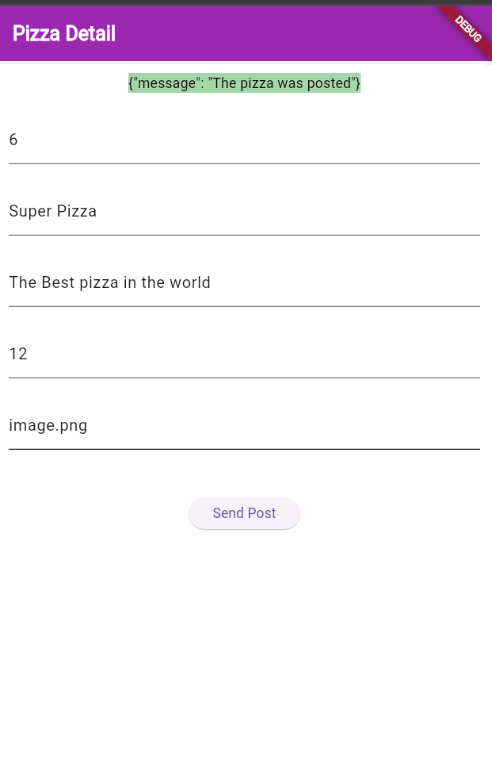
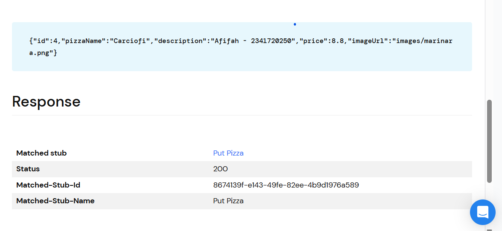
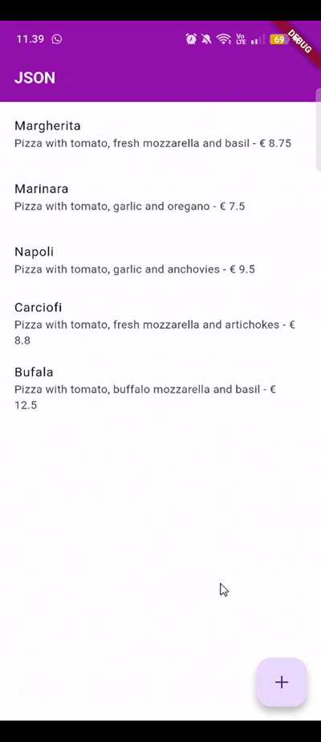

# RESTFUL API 🔥

<table>
  <tr>
    <td><b>Nama</b></td>
    <td>:</td>
    <td>Afifah Khoirunnisa</td>
  </tr>
  <tr>
    <td><b>Kelas</b></td>
    <td>:</td>
    <td>TI-3G</td>
  </tr>
  <tr>
    <td><b>NIM</b></td>
    <td>:</td>
    <td>2341720250</td>
  </tr>
  <tr>
    <td><b>No. Abs</b></td>
    <td>:</td>
    <td>02</td>
  </tr>
</table>  

---
# PRAKTIKUM 1

### helper.dart
```dart
import 'dart:io'; 
import 'package:http/http.dart' as http; 
import 'dart:convert'; 
import 'pizza.dart'; 

class HttpHelper {
  final String authority = '02z2g.mocklab.io';
  final String path = 'pizzalist';
  Future<List<Pizza>> getPizzaList() async {
    final Uri url = Uri.https(authority, path);
    final http.Response result = await http.get(url);
    if (result.statusCode == HttpStatus.ok) {
      final jsonResponse = json.decode(result.body);
      //provide a type argument to the map method to avoid type 
      //error
      List<Pizza> pizzas =
          jsonResponse.map<Pizza>((i) => 
            Pizza.fromJson(i)).toList();
      return pizzas;
    } else {
      return [];
    }
  }
}
```

### main.dart
```dart
Future<List<Pizza>> callPizzas() async {
  HttpHelper helper = HttpHelper(); 
  List<Pizza> pizzas = await helper.getPizzaList(); 
  return pizzas; 
}

Widget build(BuildContext context) { 
    return Scaffold(
      appBar: AppBar(title: const Text('JSON')),
      body: FutureBuilder(
          future: callPizzas(),
          builder: (BuildContext context, AsyncSnapshot<List<Pizza>> 
snapshot) {
          if (snapshot.hasError) {
            return const Text('Something went wrong');
          }
          if (!snapshot.hasData) {
            return const CircularProgressIndicator();
          }
            return ListView.builder(
                itemCount: (snapshot.data == null) ? 0 : snapshot.
data!.length,
                itemBuilder: (BuildContext context, int position) {
                  return ListTile(
                    title: Text(snapshot.data![position].pizzaName),
                    subtitle: Text(snapshot.data![position].
description +
                        ' - € ' +
                        snapshot.data![position].price.toString()),
                  );
                });
          }),
    );  
}
```

# SOAL
### **1. Tambahkan nama panggilan Anda pada title app sebagai identitas hasil pekerjaan Anda. Gadnti warna tema aplikasi sesaai kesukaan Anda.**

```dart
Widget build(BuildContext context) {
    return MaterialApp(
      title: 'JSON - Afifah',
      theme: ThemeData(
        scaffoldBackgroundColor: Colors.white, // background putih
        appBarTheme: const AppBarTheme(
          backgroundColor: Colors.purple,
          elevation: 0,
          titleTextStyle: TextStyle(
            color: Colors.white,
            fontSize: 20,
            fontWeight: FontWeight.bold,
          ),
        ),
      ),
      home: const MyHomePage(),
    );
  }
```

### **Capture hasil aplikasi Anda, lalu masukkan ke laporan di README dan lakukan commit hasil jawaban Soal 1 dengan pesan "W14: Jawaban Soal 1"**


# PRAKTIKUM 2
### httphelper.dart

```dart
Future<String> postPizza(Pizza pizza) async {
    const postPath = 'pizza';
    String post = json.encode(pizza.toJson());
    Uri url = Uri.https(authority, postPath);

    http.Response r = await http.post(
      url,
      headers: {"Content-Type": "application/json"},
      body: post,
    );
    return r.body;
  }
```
### main.dart
```dart
home: const PizzaDetailScreen(),
```

### pizza_detail.dart
```dart
import 'package:flutter/material.dart';
import 'httphelper.dart';
import 'model/pizza.dart';

class PizzaDetailScreen extends StatefulWidget {
  const PizzaDetailScreen({super.key});
  @override
  State<PizzaDetailScreen> createState() => _PizzaDetailScreenState();
}

class _PizzaDetailScreenState extends State<PizzaDetailScreen> {
  final TextEditingController txtId = TextEditingController();
  final TextEditingController txtName = TextEditingController();
  final TextEditingController txtDescription = TextEditingController();
  final TextEditingController txtPrice = TextEditingController();
  final TextEditingController txtImageUrl = TextEditingController();
  String operationResult = '';

  @override
  Widget build(BuildContext context) {
    return Scaffold(
      appBar: AppBar(title: const Text('Pizza Detail')),
      body: Padding(
        padding: const EdgeInsets.all(12),
        child: SingleChildScrollView(
          child: Column(
            children: [
              Text(
                operationResult,
                style: TextStyle(
                  backgroundColor: Colors.green[200],
                  color: Colors.black,
                ),
              ),
              const SizedBox(height: 24),
              TextField(
                controller: txtId,
                decoration: const InputDecoration(hintText: 'Insert ID'),
              ),
              const SizedBox(height: 24),
              TextField(
                controller: txtName,
                decoration: const InputDecoration(
                  hintText: 'Insert Pizza Name',
                ),
              ),
              const SizedBox(height: 24),
              TextField(
                controller: txtDescription,
                decoration: const InputDecoration(
                  hintText: 'Insert Description',
                ),
              ),
              const SizedBox(height: 24),
              TextField(
                controller: txtPrice,
                decoration: const InputDecoration(hintText: 'Insert Price'),
                keyboardType: TextInputType.number,
              ),
              const SizedBox(height: 24),
              TextField(
                controller: txtImageUrl,
                decoration: const InputDecoration(hintText: 'Insert Image Url'),
              ),
              const SizedBox(height: 48),
              ElevatedButton(
                child: const Text('Send Post'),
                onPressed: () {
                  postPizza();
                },
              ),
            ],
          ),
        ),
      ),
    );
  }

  @override
  void dispose() {
    txtId.dispose();
    txtName.dispose();
    txtDescription.dispose();
    txtPrice.dispose();
    txtImageUrl.dispose();
    super.dispose();
  }

  Future<void> postPizza() async {
    HttpHelper helper = HttpHelper();

    // Buat objek Pizza dari TextField
    Pizza pizza = Pizza(
      id: int.parse(txtId.text),
      pizzaName: txtName.text,
      description: txtDescription.text,
      price: double.tryParse(txtPrice.text),
      imageUrl: txtImageUrl.text,
    );

    // Kirim POST
    String response = await helper.postPizza(pizza);

    // Tampilkan hasil
    setState(() {
      operationResult = response;
    });
  }
}
```

# SOAL
### **2. Tambahkan field baru dalam JSON maupun POST ke Wiremock! Capture hasil aplikasi Anda berupa GIF di README dan lakukan commit hasil jawaban Soal 2 dengan pesan "W14: Jawaban Soal 2"**



# PRAKTIKUM 3
# httphelper.dart
```dart
Future<String> putPizza(Pizza pizza) async {
    const putPath = '/pizza';
    String put = json.encode(pizza.toJson());
    Uri url = Uri.https(authority, putPath);
    http.Response r = await http.put(
      url,
      headers: {"Content-Type": "application/json"},
      body: put,
    );
    return r.body;
  }
```
### SOAL
### **3. Ubah salah satu data dengan Nama dan NIM Anda, lalu perhatikan hasilnya di Wiremock.**


### **Capture hasil aplikasi Anda berupa GIF di README dan lakukan commit hasil jawaban Soal 3 dengan pesan "W14: Jawaban Soal 3"**


# PRAKTIKUM 4
### httphelper.dart
```dart
Future<String> deletePizza(int id) async {
    const deletePath = '/pizza';
    Uri url = Uri.https(authority, deletePath);

    http.Response r = await http.delete(url);
    return r.body;
  }
```

### main.dart
```dart
import 'package:flutter/material.dart';
import 'httphelper.dart';
import 'model/pizza.dart';
import 'pizza_detail.dart';

void main() {
  runApp(const MyApp());
}

class MyApp extends StatelessWidget {
  const MyApp({super.key});

  @override
  Widget build(BuildContext context) {
    return const MaterialApp(
      home: MyHomePage(),
      debugShowCheckedModeBanner: false,
    );
  }
}

class MyHomePage extends StatefulWidget {
  const MyHomePage({super.key});

  @override
  State<MyHomePage> createState() => _MyHomePageState();
}

class _MyHomePageState extends State<MyHomePage> {
  List<Pizza> pizzas = [];
  bool loading = true;

  @override
  void initState() {
    super.initState();
    loadData();
  }

  Future<void> loadData() async {
    HttpHelper helper = HttpHelper();
    pizzas = await helper.getPizzaList();
    setState(() => loading = false);
  }

  @override
  Widget build(BuildContext context) {
    return Scaffold(
      backgroundColor: Colors.white,
      appBar: AppBar(
      backgroundColor: Colors.purple,
      title: const Text(
        'JSON - Afifah',
        style: TextStyle(
        color: Colors.white,
        fontSize: 20,
        fontWeight: FontWeight.bold,
        ),
      ),
      ),

      body: loading
        ? const Center(child: CircularProgressIndicator())
        : ListView.builder(
          itemCount: pizzas.length,
          itemBuilder: (context, position) {
          final pizza = pizzas[position];

          return Dismissible(
            key: Key(pizza.id.toString()),
            direction: DismissDirection.endToStart,

            confirmDismiss: (direction) async {
            // ➜ popup dulu, lalu return true/false
            return await showDialog(
              context: context,
              builder: (context) => AlertDialog(
              title: const Text("Hapus Pizza?"),
              content:
                Text("Yakin ingin menghapus ${pizza.pizzaName}?"),
              actions: [
                TextButton(
                onPressed: () => Navigator.of(context).pop(false),
                child: const Text("Batal"),
                ),
                TextButton(
                onPressed: () => Navigator.of(context).pop(true),
                child: const Text("Hapus"),
                ),
              ],
              ),
            );
            },

            onDismissed: (direction) async {
            final deletedId = pizza.id;

            // hapus dari UI
            setState(() {
              pizzas.removeAt(position);
            });

            // delete ke server
            HttpHelper helper = HttpHelper();
            await helper.deletePizza(deletedId);
            },

            background: Container(
            color: Colors.red,
            alignment: Alignment.centerRight,
            padding: const EdgeInsets.only(right: 20),
            child: const Icon(Icons.delete, color: Colors.white),
            ),

            child: ListTile(
            title: Text(pizza.pizzaName),
            subtitle:
              Text("${pizza.description} - € ${pizza.price}"),
            onTap: () {
              Navigator.push(
              context,
              MaterialPageRoute(
                builder: (_) =>
                  PizzaDetailScreen(pizza: pizza, isNew: false),
              ),
              );
            },
            ),
          );
          },
        ),

      floatingActionButton: FloatingActionButton(
      child: const Icon(Icons.add),
      onPressed: () {
        Navigator.push(
        context,
        MaterialPageRoute(
          builder: (_) => PizzaDetailScreen(
          pizza: Pizza(
            id: 0,
            pizzaName: "",
            description: "",
            price: 0,
            imageUrl: ""),
          isNew: true,
          ),
        ),
        );
      },
      ),
    );
  }
}
```

# SOAL
### **4. Capture hasil aplikasi Anda berupa GIF di README dan lakukan commit hasil jawaban Soal 4 dengan pesan "W14: Jawaban Soal 4"**
